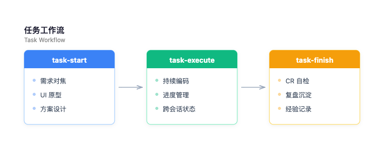

# Claude Code Skills

<p align="center">
  <a href="https://github.com/312362115/claude/stargazers">
    
  </a>
  <a href="https://github.com/312362115/claude/network/members">
    
  </a>
  <a href="https://github.com/312362115/claude/issues">
    
  </a>
  <a href="https://github.com/312362115/claude/blob/main/LICENSE">
    
  </a>
</p>

> **做好比做完重要** — 以字节范（ByteStyle）核心价值观驱动的 AI 辅助开发体系

一套围绕 [Claude Code](https://docs.anthropic.com/en/docs/claude-code) 构建的专业开发脚手架，包含 **6 个自研技能**、完整的 **任务工作流体系**、**30+ 种图表生成能力** 和 **专业研究报告引擎**，让 Claude 从代码助手进化为全流程开发伙伴。

---

## 核心亮点

- **结构化任务工作流** — `task-start → task-execute → task-finish`，从需求对焦到代码自检再到复盘沉淀，全流程闭环
- **30+ 种专业图表** — 覆盖结构图（流程图、ER 图、类图、状态图、C4 架构图…）和统计图（柱状图、雷达图、桑基图、热力图…），统一设计规范
- **深度调研引擎** — 假设驱动、多跳网络搜索、交叉验证、反面证据强制搜索，输出专业研究报告
- **跨会话持续执行** — 大型任务自动管理进度，跨多轮对话不丢上下文
- **文档即资产** — 所有决策、方案、复盘随 git 提交，知识可追溯

---

## 技能体系

### 总览

| 技能 | 用途 | 触发方式 |
|------|------|---------|
| **task-start** | 任务启动：需求对焦 + UI 原型确认 + 方案设计 | `/task-start` 或 "新功能"、"实现xxx" |
| **task-execute** | 持续执行：跨会话大型任务进度管理 | `/task-execute` |
| **task-finish** | 任务收尾：CR 自检 + 复盘沉淀 | `/task-finish` 或 "提交代码"、"复盘" |
| **diagram** | 专业图表生成（PNG / HTML / Mermaid DSL） | `/diagram` 或 "画图"、"图表" |
| **deep-research** | 深度调研，输出专业研究报告 | `/deep-research` 或 "调研"、"分析报告" |
| **preview-md** | MD 文件浏览器预览（统一设计规范 + 目录 + Mermaid 渲染） | `/preview-md` 或 "预览文档" |

### 任务工作流

根据任务复杂度自动匹配深度：

```
小任务（≤2 文件）         → 直接动手
中任务（有模糊点）        → task-start 对焦 → 开发
大任务（3+ 文件 / 新模块） → task-start → task-execute → task-finish
跨会话任务               → 必须启用 task-execute
```

<p align="center">
  
</p>

### diagram — 专业图表生成

覆盖 **30+ 种图表**（流程图、时序图、ER 图、类图、状态图、架构图、甘特图、思维导图、C4、桑基图、雷达图、热力图、矩形树图、Kanban、Git Graph、鱼骨图、SWOT 图、文氏图等），统一使用 HTML/SVG + Playwright 截图渲染，所有图表共享一套设计规范。

三种输出格式：**PNG**（默认）、**HTML**（交互式）、**Mermaid DSL**（20+ 种图表支持，可版本控制，配合 preview-md 实时渲染）

```
> 画一个用户注册的流程图
> 帮我生成一个技术选型的雷达图，对比 React / Vue / Svelte
> 画个数据库 ER 图，包含用户、订单、商品三张表
```

### deep-research — 深度调研报告

对任意命题进行系统性调研，输出结构化研究报告。支持技术选型、竞品分析、行业研究等场景。核心方法论：假设驱动、多跳网络搜索、交叉验证、反面证据强制搜索。

输出格式：**Markdown**（日常，可 diff）或 **HTML**（正式交付，专业排版），报告中自动生成配套图表。

```
> 调研一下目前主流的前端状态管理方案
> 帮我做个 Supabase vs Firebase 的对比分析报告
> 研究一下 2026 年 AI Agent 框架的技术趋势
```

### preview-md — Markdown 浏览器预览

将 MD 文件渲染为网页预览，与 HTML 报告共用同一套设计规范（配色、排版、组件），视觉风格统一。支持左侧自动目录（h1-h4）、滚动高亮，并内置 Mermaid 渲染引擎，diagram 技能输出的 Mermaid DSL 代码块可直接实时渲染为 SVG 图表。

方案设计（`docs/specs/`）和开发计划（`docs/plans/`）完成后会自动询问是否预览。同时提供 VS Code 扩展（`extensions/preview-md-launcher`），可在编辑器中右键直接打开浏览器预览。

```
> 预览一下刚写的方案文档
> /preview-md docs/specs/2026-04-01-auth-design.md
```

### 三档输出体系

报告与图表按场景分三档，共用一套设计规范，视觉风格统一：

| 档位 | 报告 | 图表 | 预览 | 适用场景 |
|------|------|------|------|---------|
| **日常** | MD（deep-research） | Mermaid DSL（diagram） | preview-md 浏览器渲染 | 内部文档、方案设计、技术调研 |
| **正式** | HTML（deep-research） | HTML（diagram） | 浏览器直接打开 | 对外交付、正式报告 |
| **其它** | — | PNG（diagram） | — | PPT 插入、邮件附件 |

---

## 项目结构

```
~/.claude/
├── CLAUDE.md              # 全局开发规范（字节范 ByteStyle）
├── package.json           # 依赖：dagre, elkjs
├── settings.json          # 插件与 MCP 配置
│
├── skills/                # 6 个自研技能
│   ├── task-start/        #   任务启动
│   ├── task-execute/      #   持续执行
│   ├── task-finish/       #   任务收尾
│   ├── diagram/           #   图表生成
│   ├── deep-research/     #   深度调研
│   ├── preview-md/        #   MD 预览
│   └── shared/            #   共享样式（色板、排版）
│
├── extensions/            # VS Code 扩展
│   └── preview-md-launcher/  # MD 浏览器预览插件
│
├── docs/                  # 项目文档（随 git 提交）
│   ├── backlog/           #   需求池
│   ├── specs/             #   方案设计
│   ├── plans/             #   开发计划
│   ├── tests/             #   测试用例
│   ├── decisions/         #   复盘记录
│   └── assets/            #   图表资源
│
└── plugins/               # 官方插件缓存
```

---

## 快速开始

### 1. 安装

打开 Claude Code，直接告诉它：

```
帮我把 https://github.com/312362115/claude 仓库里的 skills/ 目录
安装到我的 ~/.claude/skills/ 下
```

Claude 会自动完成克隆和复制，不会覆盖你已有的 `CLAUDE.md`、`settings.json` 等个人配置。所有依赖（如 ELKjs 布局引擎）已内联打包在 skills 目录中，无需额外安装。

### 2. 使用

安装完成后，在 Claude Code 中用斜杠命令或自然语言即可触发：

```
/task-start          # 启动新任务，需求对焦 + 方案设计
/task-execute        # 跨会话持续执行大型任务
/task-finish         # 代码自检 + 复盘
/diagram             # 生成专业图表
/deep-research       # 深度调研报告
/preview-md          # 浏览器预览 MD 文件
```

```
"帮我画一个系统架构图"        → 自动触发 diagram
"调研一下 React vs Vue"      → 自动触发 deep-research
"我要实现用户认证模块"        → 自动触发 task-start
```

---

## 开发规范 — 字节范（ByteStyle）

本项目遵循五大核心原则：

| 原则 | 关键词 | 要求 |
|------|--------|------|
| **始终创业** | MVP、最简方案 | 最少代码解决当前问题，不为假想需求增加复杂度 |
| **坦诚清晰** | 暴露问题、代码即文档 | 命名自解释，遇到不确定直接提问 |
| **求真务实** | 根因驱动、先读后改 | 修改前理解现有实现，bug 先复现再修复 |
| **多元兼容** | 尊重风格、依赖克制 | 保持与项目已有模式一致 |
| **敢为极致** | 安全第一、验证护航 | 核心逻辑必须有测试覆盖 |

---

## 依赖

- **[ELKjs](https://github.com/kieler/elkjs)** — 图布局引擎（ER 图、类图、状态图等），已内联打包，无需安装
- **[Playwright MCP](https://github.com/microsoft/playwright-mcp)** — HTML → PNG 截图，需在 Claude Code 中启用 Playwright 插件

---

## Star History

<p align="center">
  
</p>

---

## 许可证

[MIT](LICENSE)
