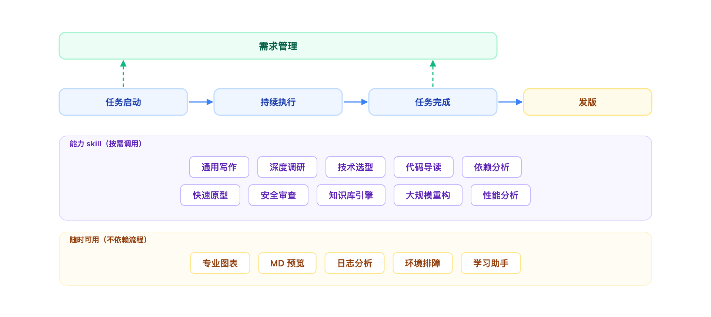

# Claude Code Skills

[](https://github.com/312362115/claude/stargazers)&nbsp;&nbsp;
[](https://github.com/312362115/claude/network/members)&nbsp;&nbsp;
[](https://github.com/312362115/claude/issues)&nbsp;&nbsp;
[](https://github.com/312362115/claude/blob/main/LICENSE)

一套以**需求状态流转为核心**的 [Claude Code](https://docs.anthropic.com/en/docs/claude-code) 开发工作流。需求从创建到关闭的每个状态变更，驱动对应的开发动作自动发生——对焦、方案、编码、自检、复盘，全程闭环。20 个 skill 围绕这条主线提供调研、写作、图表、安全审查、性能分析等增强能力。

---

## 工作流全景

<p align="center">
  
</p>

---

## 亮点

- **需求驱动工作流** — open → in-progress → done，需求关闭时自动复盘，形成经验闭环
- **29 种专业图表** — 流程图、ER 图、架构图、雷达图、桑基图等，统一设计规范
- **深度调研引擎** — 假设驱动、多跳搜索、交叉验证，输出专业研究报告
- **AI 安全审查** — 注入/认证/敏感数据/配置/业务安全 5 个维度
- **通用写作** — 技术文档 / 产品文档 / 项目汇报（精排 HTML），7 个文档模板
- **知识库引擎** — 参考 Karpathy LLM Wiki，持续维护 docs/ 为活的知识库
- **大规模重构** — 影响分析 → 安全网 → 分步重构 → 回归验证

---

## 快速开始

打开 Claude Code，告诉它：

```
帮我把 https://github.com/312362115/claude 仓库里的 skills/ 目录安装到我的 ~/.claude/skills/ 下
```

无需额外安装依赖。安装后用自然语言即可触发：

```
"帮我画一个系统架构图"        → diagram
"调研一下 React vs Vue"      → deep-research
"帮我写个技术方案"            → writing
"这块代码帮我梳理一下"        → code-walkthrough
"安全审计一下"                → security-audit
"这个需求做完了"              → task-manager（复盘 + 沉淀）
```

也支持斜杠命令：`/diagram`  `/deep-research`  `/task-start`  `/release` 等。

---

## 技能体系

### 流程 Skill（5 个）— 调度"做什么"

| Skill | 定位 |
|-------|------|
| **task-manager** | 需求全生命周期管理，需求标 done 时触发复盘 |
| **task-start** | 任务启动调度：对焦 + 调度调研/选型/写方案 |
| **task-execute** | 跨会话大型任务持续执行 |
| **task-finish** | 提交前 CR 自检 |
| **refactoring** | 大规模重构结构化流程 |

### 能力 Skill（15 个）— 负责"怎么做"

| 领域 | Skill | 一句话 |
|------|-------|--------|
| 安全质量 | **security-audit** | AI 安全审查 5 个维度 |
| | **perf-profiling** | 前后端性能分析 |
| 写作表达 | **writing** | 技术文档 / 产品文档 / 汇报 HTML |
| | **deep-research** | 深度调研 + 专业报告 |
| | **tech-evaluation** | 技术选型决策 |
| | **diagram** | 29 种专业图表 |
| 代码理解 | **code-walkthrough** | 代码导读，建立心智模型 |
| | **dependency-map** | 依赖分析，影响面评估 |
| 开发辅助 | **release** | CalVer + changelog + GitHub Releases |
| | **rapid-prototype** | 5 分钟可交互 HTML demo |
| | **preview-md** | Markdown 浏览器预览 |
| 日常效率 | **log-analysis** | 日志分析（异常定位 → 根因） |
| | **env-troubleshoot** | 环境排障 |
| | **docs-management** | 知识库引擎 |
| | **learning-companion** | 学习助手 |

> 详细文档见 [skills/README.md](skills/README.md)

---

## Star History

<p align="center">
  
</p>

---

## 许可证

[MIT](LICENSE)
