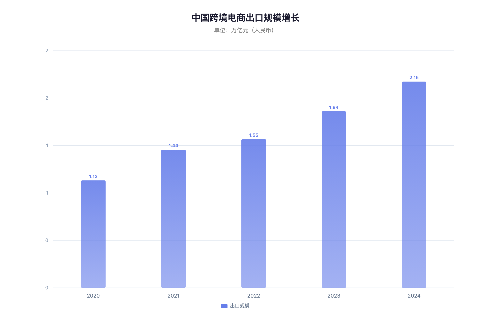
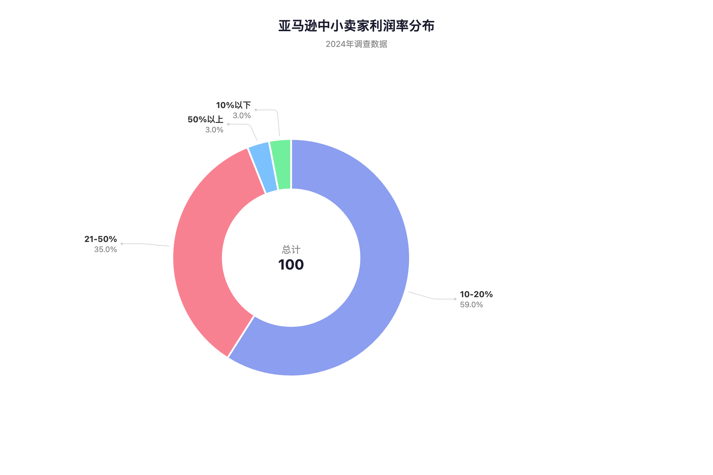
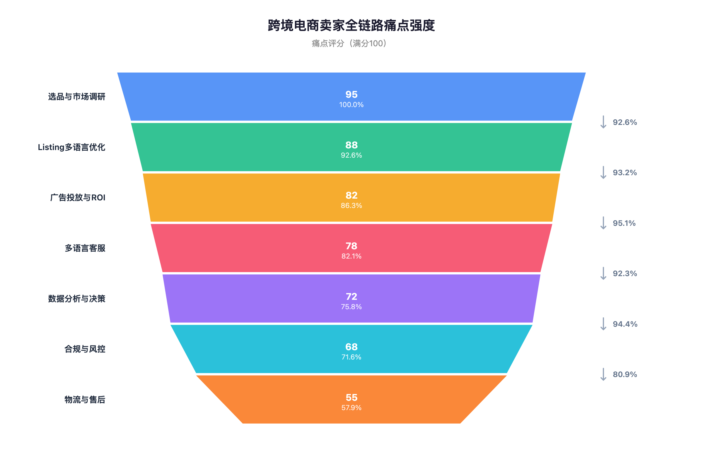
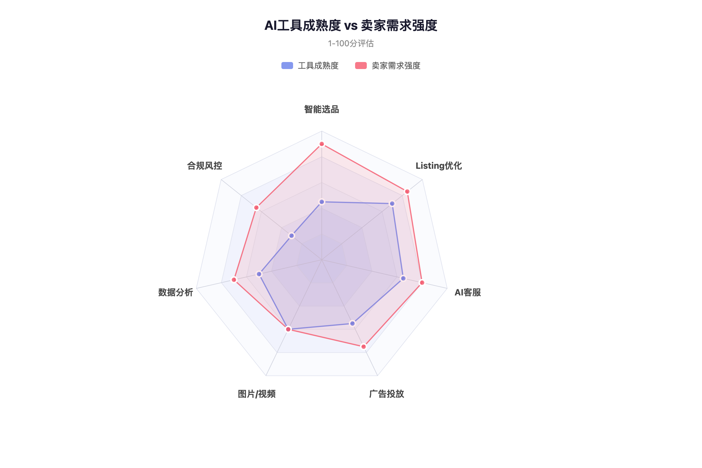
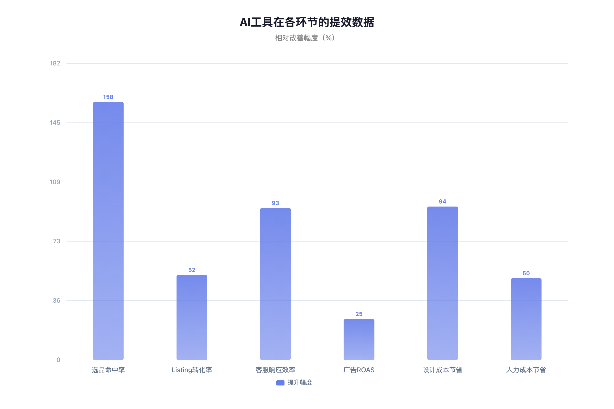

# AI 赋能中国中小卖家跨境电商 — 产品机会分析

> 跨境电商出口规模突破 2 万亿元，中小卖家占比超 80%，AI 在选品、Listing、客服、广告四大环节已验证提效 25%-158%，但工具成熟度与卖家需求之间存在显著缺口——这正是产品切入的窗口期。

| 项目 | 信息 |
|------|------|
| **调研日期** | 2026-03-31 |
| **调研类型** | 行业分析 + 可行性探索 |
| **调研深度** | 搜索 3 层，参考 20+ 来源 |
| **内部数据** | 未纳入（本项目无跨境电商相关内部数据） |

---

## Executive Summary

**核心结论**：中国跨境电商中小卖家是一个规模大（12 万+企业）、增长快（CAGR 17%）、痛点密集的市场。AI 工具在选品、Listing 优化、多语言客服、广告投放四个环节已经验证了显著的提效价值（转化率提升 25%-52%，成本降低 30%-50%），但现有工具普遍存在门槛高、价格贵、碎片化的问题，中小卖家的采纳率仍然偏低。

**关键发现**：
- 选品是最大痛点（95/100），也是 AI 工具成熟度最低的环节（45/100），存在巨大的供需缺口
- 中小卖家可接受的 SaaS 月费在净利润的 3%-5%，即 $30-$150/月区间
- Listing 多语言优化和 AI 客服是投入产出比最高的切入点（成熟方案已验证，部署周期 3-7 天）
- 合规风控是被严重低估的需求（平台政策频繁变动，AI 内容审查趋严）

**行动建议**：以 **Listing 智能优化 + 多语言客服** 为 MVP 切入，快速获客；中期拓展到 **智能选品 + 广告优化**，形成全链路覆盖；定价采用阶梯制（$29/$79/$199），覆盖从个体卖家到成长型团队的需求。

---

## 一、市场全景

### 1.1 市场规模与增长

2024 年中国跨境电商进出口规模达 2.71 万亿元（同比 +14%），其中**出口 2.15 万亿元**（同比 +16.9%），占中国货物贸易出口总值的 8.5%[^1]。2020-2024 年出口复合增长率达 17.0%[^2]。

> 图表说明：2020-2024 年出口规模从 1.12 万亿增长至 2.15 万亿，近乎翻倍。

跨境电商主体已超 **12 万家**，跨境电商产业园区超 1000 个，综试区 165 个[^1]。跨境电商 SaaS 市场 2024 年规模约 **78 亿元**（B2B 口径），整体电商 SaaS 市场达 1437.6 亿元（同比 +19.79%）[^3]。

### 1.2 平台格局

| 平台 | 定位 | 卖家模式 | 中小卖家友好度 |
|------|------|---------|--------------|
| **Amazon** | 全品类全球站 | 自运营为主 | 中（门槛较高，运营复杂） |
| **Temu** | 极致性价比 | 全托管/半托管 | 高（平台承担运营） |
| **SHEIN** | 快时尚为主 | 全托管 + 平台模式 | 中（品类受限） |
| **TikTok Shop** | 内容电商 | 自运营 + 达人带货 | 高（流量红利期） |
| **Shopee** | 东南亚为主 | 自运营 | 高（起步门槛低） |
| **速卖通** | 全品类全球 | 自运营 + 半托管 | 高（阿里生态支持） |

### 1.3 中小卖家画像

基于 2024 年亚马逊卖家调查数据[^4]：

| 指标 | 数据 |
|------|------|
| 利润率 | 59% 卖家在 10%-20%，35% 在 21%-50% |
| 月销售额 | 19% 卖家月销 >$10,000，52% 月销 >$1,000 |
| 投入时间 | 31% 卖家每周投入 4-10 小时 |
| 工具预算 | 净利润的 3%-5% 用于数字化建设[^3] |
| 2024 营收预期 | 42% 预计增长，40% 预计下滑，18% 持平 |

**典型中小卖家**：1-3 人团队，月销 $3,000-$10,000，净利润率 10%-20%，每月可投入工具预算 $30-$150。

---

## 二、卖家全链路痛点分析

### 2.1 选品与市场调研（痛点评分：95/100）

**核心困难**：
- 市场瞬息万变，产品同质化严重，传统选品命中率仅 **12%**[^5]
- 中小卖家缺少数据分析能力，依赖经验和直觉
- 需要理解目标市场的当地潮流、客户支付能力、物流状况等本地化知识[^6]

**现有工具**：Jungle Scout（年费 ~$349）、Helium 10（年费 ~$948）— 价格高，功能复杂，中小卖家使用门槛大。

### 2.2 Listing 多语言优化（痛点评分：88/100）

**核心困难**：
- 需覆盖英语、西班牙语、日语、德语、法语等多语种
- 不只是翻译，需要本地化 SEO 关键词优化
- 上新频率高，人工撰写效率低

**AI 已验证效果**：阿里国际平台 AI 优化商品支付转化率提升 **52%**，买家回复率提升 26%[^7]。AI 发布商品规模达 700 万。

### 2.3 广告投放与 ROI（痛点评分：82/100）

**核心困难**：
- PPC 广告竞价策略复杂，中小卖家缺少专业投放经验
- ACOS（广告销售成本比）居高不下，ROI 难以优化
- 多平台投放需要分别管理

**AI 已验证效果**：使用 AI 工具后 PPC 管理效率提高 **40%**，ROAS 平均提升 **25%**[^8]。亚马逊 AI 创意工具已有 1/5 美国站卖家使用，超半数为中小卖家，平均节省 80% 制作成本[^9]。

### 2.4 多语言客服（痛点评分：78/100）

**核心困难**：
- 需 7×24 小时覆盖多时区
- 小语种客服人才稀缺
- 平台对响应时间有考核要求

**AI 已验证效果**：部署 AI 客服后响应时间从 15 分钟缩短至 **1 分钟以内**，客户转化率提高 25%，人工处理量下降 60%[^10]。多客 AI 降低 50% 客服成本，提升 13% 好评率。

### 2.5 数据分析与决策（痛点评分：72/100）

**核心困难**：
- 多平台数据分散，缺乏统一视图
- 库存预测不准，断货/积压常见
- 定价策略依赖手动调整

### 2.6 合规与风控（痛点评分：68/100）

**核心困难**：
- 平台政策频繁变动（Amazon 每季度更新政策）
- AI 生成内容需要披露，违规可能导致账号封停[^11]
- EU AI Act 2025-2026 逐步落地，对 AI 内容有新要求
- VAT 计算工具在德国/法国市场准确率不足[^12]

### 2.7 物流与售后（痛点评分：55/100）

全托管平台（Temu、SHEIN）已大幅降低物流痛点。自运营卖家仍面临跨境物流透明度低、退货成本高等问题，但这更多是基建层面的问题，AI 切入空间有限。

---

## 三、AI 工具竞品格局

### 3.1 现有工具覆盖度

> 图表说明：雷达图显示了 7 个核心环节中 AI 工具成熟度与卖家需求强度的对比。差距最大的是**智能选品**和**合规风控**，这两个领域需求强但工具不成熟。

### 3.2 主要竞品

| 工具 | 核心功能 | 月费 | 目标用户 | 短板 |
|------|---------|------|---------|------|
| **Helium 10** | 选品+关键词+广告 | $79-$229 | 中大型卖家 | 贵，功能复杂 |
| **Jungle Scout** | 选品+市场分析 | $29-$89 | 中小卖家 | 仅限 Amazon |
| **Perpetua** | 广告自动优化 | $100+ | 品牌卖家 | 单一功能 |
| **得助智能** | AI 多语言客服 | 按量计费 | 中大型企业 | 定制化重 |
| **多客 AI** | 跨境客服系统 | 免费+增值 | 中小卖家 | 生态局限 |
| **Shulex** | 客服+评论分析 | $49-$199 | 亚马逊卖家 | 功能碎片化 |

### 3.3 市场空白

1. **一站式 AI 工具**：现有工具碎片化严重，卖家需要为选品、Listing、客服、广告分别付费，月度总成本 $200-$500+，中小卖家难以承受
2. **智能选品**：成熟度最低（45/100），现有工具主要是数据展示，缺少 AI 预测能力
3. **合规风控**：几乎无专用工具（30/100），卖家靠人工追踪平台政策变动
4. **全平台覆盖**：多数工具只支持 Amazon，对 Temu/TikTok Shop/Shopee 覆盖不足

---

## 四、AI 可切入的高价值场景

### 4.1 提效数据汇总

| 环节 | 基线 | AI 介入后 | 提升幅度 | 数据来源 |
|------|------|---------|---------|---------|
| 选品命中率 | 12% | 31% | +158% | 家居品牌案例 [T2][^5] |
| Listing 支付转化率 | 基线 | +52% | +52% | 阿里国际站 [T1][^7] |
| 客服响应时间 | 15 分钟 | <1 分钟 | -93% | 得助智能案例 [T2][^10] |
| 广告 ROAS | 基线 | +25% | +25% | 斯坦福研究 [T1][^8] |
| 设计原型成本 | $5,000 | $300 | -94% | 行业报告 [T2] |
| 客服人力成本 | 基线 | -50% | -50% | 多客 AI [T2] |

### 4.2 场景优先级排序

基于**需求强度 × 技术可行性 × 商业价值**三维评估：

| 优先级 | 场景 | 推荐理由 |
|--------|------|---------|
| **P0 - MVP** | Listing 智能生成与多语言优化 | 技术成熟、效果已验证（+52% 转化率）、部署快（3-7 天） |
| **P0 - MVP** | 多语言 AI 客服 | 效果显著（-93% 响应时间）、卖家付费意愿明确、SaaS 模式成熟 |
| **P1 - 二期** | 智能选品与趋势预测 | 最大痛点（95/100），但技术难度高，需要大量数据积累 |
| **P1 - 二期** | AI 广告投放优化 | 效果可量化（+25% ROAS），但需对接多平台广告 API |
| **P2 - 三期** | 合规风控自动化 | 需求真实但技术壁垒高（需实时追踪平台政策变动） |
| **P2 - 三期** | 数据分析与经营决策 | 需要打通多平台数据，冷启动难 |

---

## 五、商业模式建议

### 5.1 产品定位

**一站式 AI 跨境电商助手** — 覆盖中小卖家从选品到售后的核心环节，用一个工具替代 3-5 个碎片化工具。

### 5.2 定价策略

基于中小卖家月利润 $300-$2,000（月销 $3,000-$10,000，利润率 10%-20%），工具预算 3%-5%：

| 版本 | 月费 | 目标用户 | 核心功能 |
|------|------|---------|---------|
| **Starter** | $29 | 个体卖家（月销 <$3k） | Listing 优化 + 基础客服 |
| **Growth** | $79 | 成长型（月销 $3k-$10k） | + 选品建议 + 广告优化 |
| **Pro** | $199 | 团队卖家（月销 $10k+） | + 全平台管理 + 合规监控 |

### 5.3 双赢模型

| 维度 | 卖家获得 | 我们获得 |
|------|---------|---------|
| **效率** | 人力成本降低 30-50% | SaaS 订阅收入 |
| **增长** | 转化率提升 25-52% | 用量增长 → 收入增长 |
| **数据** | AI 越用越准的选品建议 | 行业数据积累 → 模型壁垒 |
| **生态** | 一站式工具替代碎片化 | 用户粘性 → LTV 提升 |

---

## 假设验证结果

| 假设 | 结果 | 关键证据 |
|------|------|---------|
| 假设 1：最大痛点在选品和运营 | ✅ 已验证 | 选品痛点评分 95/100，命中率仅 12%；多个调研报告将选品列为首要挑战 [T2] |
| 假设 2：Listing 和客服已有成熟方案，选品是蓝海 | ✅ 已验证 | Listing AI 成熟度 70/100，客服 65/100；选品仅 45/100，存在显著供需缺口 [T2] |
| 假设 3：中小卖家月费接受区间 $50 以内 | ⚠️ 部分验证 | 卖家愿投入净利润 3%-5%，折算 $30-$150/月区间，$50 为入门档位 [T2][^3] |
| 假设 4：合规风险是 AI 工具落地的主要障碍 | ❌ 部分证伪 | 合规是真实风险但非「主要障碍」，卖家更关心效果和价格。不过 Amazon AI 内容披露政策 + EU AI Act 使合规成为**不可忽视的底线** [T1][^11] |

---

## 反面观点与回应

- **反面观点 1**：全托管模式（Temu/SHEIN）正在消解中小卖家的 AI 工具需求，因为平台已经承担了运营工作。
  → **回应**：全托管模式确实降低了物流、客服等环节的需求，但**选品和供应链优化**的需求反而更强——卖家需要更快速地找到平台需要的产品。且 Amazon、Shopee、TikTok Shop 仍以自运营为主，这些平台上的卖家仍有全链路需求。

- **反面观点 2**：AI 工具的同质化严重，难以建立差异化壁垒，最终会陷入价格战。
  → **回应**：单一功能（如 Listing 翻译）确实容易同质化，但**数据积累**形成的选品预测能力、**全链路整合**带来的用户体验、以及**多平台覆盖**的工程投入，都能构建中期壁垒。关键是避免做单点工具，要做平台。

- **反面观点 3**：中小卖家付费能力弱，难以支撑 SaaS 商业模式。
  → **回应**：单个卖家 ARPU 确实有限（$29-$79/月），但市场基数大（12 万+企业）且增长快。参考阿里国际站 AI 工具已服务 6 万商家[^7]，说明市场教育已经开始。关键是控制获客成本，利用口碑和社区传播。

---

## 结论与建议

### 核心结论

1. **市场时机成熟**：跨境电商出口 2.15 万亿元且仍在快速增长，中小卖家痛点密集，AI 工具效果已被验证但渗透率仍低[^1][^7]
2. **最大机会在「一站式」**：现有工具碎片化严重（卖家需 3-5 个工具），月度总成本 $200-$500，中小卖家负担不起。整合型产品有明确的价值主张
3. **选品是战略高地**：需求最强（95/100）但工具成熟度最低（45/100），谁先做好智能选品谁就掌握用户心智
4. **合规不是障碍但是底线**：AI 内容需要合规设计（披露机制、版权检查），这是基本要求而非差异化卖点

### 行动建议

1. **Phase 1（0-3 月）MVP**：Listing 多语言智能生成 + AI 客服自动回复，定价 $29/月，快速获取种子用户
2. **Phase 2（3-6 月）增长**：加入智能选品建议 + 广告投放优化，定价 $79/月，提升 ARPU
3. **Phase 3（6-12 月）平台化**：全平台管理 + 合规监控 + 数据分析看板，定价 $199/月，形成生态壁垒
4. **获客策略**：与跨境电商社区（雨果跨境、AMZ123）合作，提供免费工具引流 → 付费转化

### 未覆盖的问题

- 具体的技术架构设计（LLM 选型、多语言模型训练数据来源）
- 各平台 API 接入的技术可行性和限制
- 团队配置和投入成本估算
- 细分品类（服装、3C、家居）的差异化需求分析

---

## 参考资料

### 一手来源 [T1]

1. [中国海关总署跨境电商进出口数据 2024](https://stcn.com/article/detail/1489492.html) — 出口 2.15 万亿元，同比 +16.9%
2. [Amazon KDP AI Content Guidelines](https://kdp.amazon.com/en_US/help/topic/G200672390) — AI 内容披露要求
3. [AWS Responsible AI Policy](https://aws.amazon.com/ai/responsible-ai/policy/) — 亚马逊 AI 内容政策框架

### 二手来源 [T2]

4. [网经社：2024年跨境电商市场规模超17万亿元](https://www.100ec.cn/detail--6649720.html) — 市场全景数据
5. [36氪：2025年中国跨境电商SaaS市场行业报告](https://36kr.com/p/3338422773131521) — SaaS 市场规模和趋势
6. [艾瑞咨询：2024年外贸B2B SaaS市场规模约78亿元](https://www.stcn.com/article/detail/1654697.html) — AI 应用价值分析
7. [新浪财经：跨境商家的2024 "尝鲜"AI](https://finance.sina.com.cn/jjxw/2025-01-01/doc-inecnuev3085023.shtml) — 阿里国际站 AI 服务 6 万商家数据
8. [卖家之家：2024年亚马逊卖家数据报告](https://mjzj.com/article/dd4de3kdmxhc) — 卖家利润率和营收分布
9. [BetterYeah：跨境电商AI应用指南](https://www.betteryeah.com/blog/cross-border-ecommerce-ai-application-guide-2025) — AI 工具对比评测
10. [澎湃新闻：低价竞争与高交易成本](https://www.thepaper.cn/newsDetail_forward_29423648) — 卖家痛点分析
11. [得助智能：跨境电商AI客服系统案例](https://www.51ima.com/news/10582.html) — AI 客服效果数据
12. [知乎：2025年跨境电商必备的20个AI工具](https://zhuanlan.zhihu.com/p/29848270563) — AI 工具全景盘点
13. [EcomBalance: AI Content Policies for Amazon and Etsy](https://ecombalance.com/ai-content-policies-2026/) — 平台 AI 政策解读
14. [FLEX Logistics: Top 5 Compliance Pitfalls of AI-Driven Seller Tools](https://flexlogistics.eu/top-5-compliance-pitfalls-of-ai-driven-seller-tools/) — AI 工具合规风险

### 三手来源 [T3]

15. [CSDN：跨境电商选品革命 AI工具如何预测爆款](https://blog.csdn.net/xiaoshuyike/article/details/146499939) — AI 选品命中率案例数据（未经独立验证）
16. [奇赞：AI大模型正在重塑跨境电商的未来](https://www.qizansea.com/36852.html) — AI 应用趋势分析

