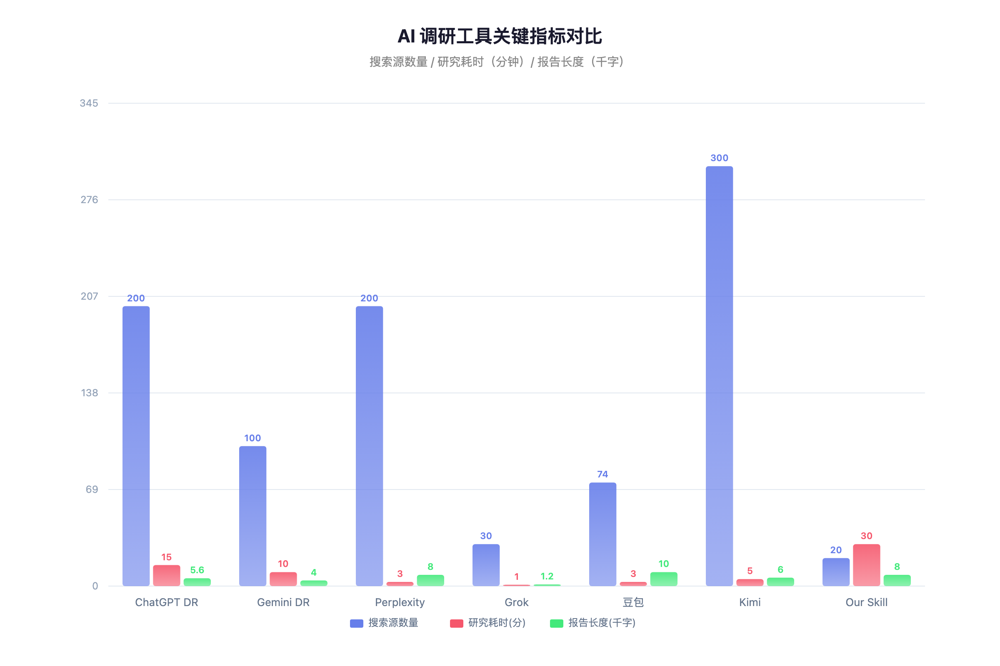
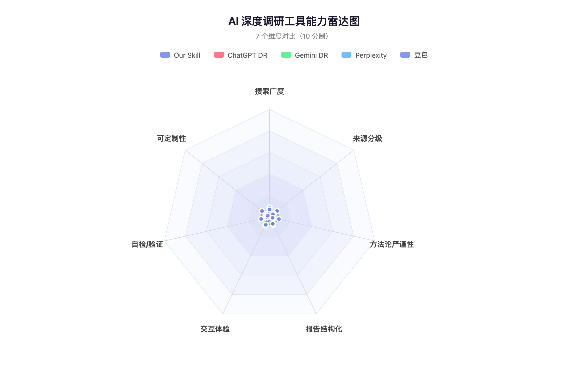
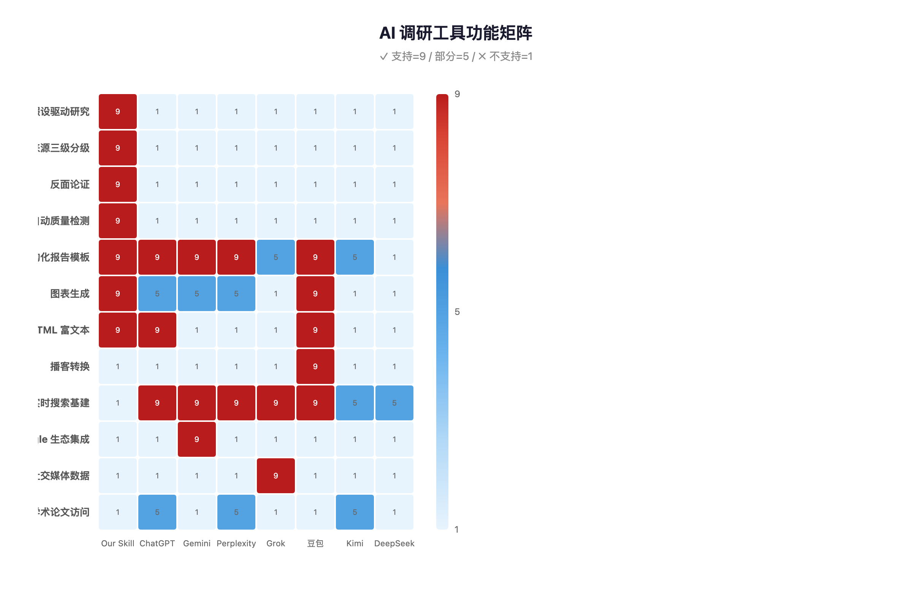

# Deep Research Skill 竞品差距分析

> 我们的方法论严谨性是独一无二的优势，但搜索基础设施和交互体验存在结构性差距。

| 项目 | 信息 |
|------|------|
| **调研日期** | 2026-04-02 |
| **调研类型** | 竞品分析 |
| **调研深度** | 搜索 3 层，参考 40+ 个来源 |
| **内部数据** | 已纳入（SKILL.md 全文 755 行） |

---

## Executive Summary

我们的 deep-research skill 在**方法论严谨性**上领先所有商业 AI 调研工具——假设驱动研究、三级来源分级（T1/T2/T3）、强制反面论证、自动质量自检，这些能力在 ChatGPT、Gemini、Perplexity、豆包等工具中均不存在。然而，在**搜索基础设施**（我们依赖 WebSearch/Playwright 逐页抓取，竞品有专用搜索索引覆盖 100-300 个源）、**交互体验**（我们是纯 CLI 输出，竞品有实时进度、可编辑计划、播客转换等）、**搜索速度**（我们 20-40 分钟，竞品 1-15 分钟）三个维度存在结构性差距。

**关键发现**：
1. 所有商业工具都遵循「查询→搜索→摘要」范式，无一做假设驱动研究——这是我们的独特差异化
2. 没有任何商业工具有系统性的输出质量自检机制——我们的 Step 6 是行业唯一
3. 来源分级（T1/T2/T3）在整个行业中缺失——Perplexity 有 E-E-A-T 排序但不透明
4. 搜索广度是最大差距：Kimi 单次读取 300-500 页，我们约 15-25 页
5. 幻觉问题是全行业通病（ChatGPT 26.57%、Perplexity 37%、Grok 4.22%），我们的分级验证机制有效缓解但未量化

**行动建议**：优先补齐搜索并行化能力（利用 Agent 工具并行搜索），其次考虑增加研究进度实时展示。方法论优势应继续保持和深化，不应为追求速度而牺牲。

---

## 现状基线

### 内部现状（基于 SKILL.md 全文分析）

我们的 deep-research skill 是一个 755 行的 prompt 工程系统，定义了 6 步工作流：

| 步骤 | 能力 | 成熟度 |
|------|------|--------|
| 1. 理解命题 | 命题解析、类型分类、初始假设、现状摸底 | 成熟 |
| 2. 多跳搜索 | 3 层搜索、WebSearch + Playwright 降级、并行搜索 | 可用但受限 |
| 3. 分析结论 | 假设验证、框架选择（20 个框架）、反面论证 | 成熟 |
| 4. 图表生成 | 29 种图表、bridge.py/capture.py 统一管道 | 成熟 |
| 5. 报告撰写 | 6 种模板、Markdown/HTML 双模式、引用标注 | 成熟 |
| 6. 质量自检 | 4 维自动检测 + 4 项手动检查 | 刚完成（本次新增） |

**核心优势**：假设驱动 + 来源三级分级 + 反面论证 + 自动质检
**核心短板**：搜索速度慢、搜索源数量少、无实时交互、纯 CLI

### 对比基线

选取 7 个竞品作为对标对象：

| 工具 | 定位 | 价格 |
|------|------|------|
| ChatGPT Deep Research | 通用深度调研，最强综合能力 | $20-200/月 |
| Gemini Deep Research | Google 生态集成，Workspace 联动 | $20-250/月 |
| Perplexity Deep Research | 速度最快，来源最多 | $20/月 |
| Grok DeepSearch | 实时性最强，X/Twitter 数据 | $10-300/月 |
| 豆包深度研究 | 国内最大用户基数，播客转换 | 免费（测试期） |
| Kimi 探索版 | 超长文档处理，最精准引用 | 免费+付费 |
| DeepSeek 深度搜索 | 开源、透明推理链、极致性价比 | 免费 |

---

## 竞品能力全景对比

### 搜索能力

| 维度 | Our Skill | ChatGPT | Gemini | Perplexity | Grok | 豆包 | Kimi |
|------|-----------|---------|--------|------------|------|------|------|
| **搜索源数量/次** | 15-25 页 | 数百页 | 100+ 页 | 200+ 页 | 15-40 页 | 74 页 | 300-500 页 |
| **搜索耗时** | 20-40 分 | 5-30 分 | 5-15 分 | 2-4 分 | 36 秒-2 分 | ~3 分 | 数十秒-数分 |
| **搜索层数** | 3 层（可配置） | 多轮迭代 | 多轮迭代 | 20-50 子查询 | 10 轮 RAG | 自动 | 9 步流水线 |
| **搜索基建** | WebSearch API + Playwright | 专用搜索基建 | Google Search | 专用搜索引擎 | Web + X API | 字节内容生态 | 专用搜索 |
| **并行搜索** | 支持（Agent 工具） | 内置 | 内置 | 云端并行 | 并行子查询 | 内置 | 100 Agent 蜂群 |

**差距分析**：搜索源数量和速度是最大差距。竞品拥有专用搜索基础设施（自建索引或直接调用 Google/Bing API 集群），我们逐页抓取效率低。Kimi 的 Agent Swarm 技术（100 个并行 agent）将搜索效率提升 4.5 倍[2]，这是值得借鉴的方向。

### 方法论严谨性

| 维度 | Our Skill | ChatGPT | Gemini | Perplexity | 豆包 | Kimi | DeepSeek |
|------|-----------|---------|--------|------------|------|------|----------|
| **假设驱动** | ✅ 2-4 个可证伪假设 | ❌ | ❌ | ❌ | ❌ | ❌ | ❌ |
| **来源分级** | ✅ T1/T2/T3 三级 | ❌ | ❌ | 部分（E-E-A-T） | ❌ | ❌ | ❌ |
| **反面论证** | ✅ 强制搜索+回应 | ❌ | ❌ | ❌ | ❌ | ❌ | ❌ |
| **质量自检** | ✅ 4 维自动检测 | ❌ | ❌ | ❌ | ❌ | ❌ | ❌ |
| **现状摸底** | ✅ 内部数据优先 | ❌ | 部分（Workspace） | ❌ | ❌ | ❌ | ❌ |
| **分析框架** | ✅ 20 个框架路由 | 无框架 | 无框架 | 无框架 | 无框架 | 无框架 | 无框架 |

**关键发现**：调研证实，**没有任何商业 AI 调研工具做假设驱动研究**[3]。所有工具都遵循「查询→搜索→摘要」范式。学术界有假设驱动的 AI 研究系统（如 AI-Researcher[4]），但尚未产品化。我们是唯一将假设验证、来源分级、反面论证、自动质检整合到工作流中的系统。

### 输出质量与格式

| 维度 | Our Skill | ChatGPT | Gemini | Perplexity | 豆包 | Kimi |
|------|-----------|---------|--------|------------|------|------|
| **报告长度** | 自适应（通常 5-10K 字） | ~5,600 词 | 多页 | 5-15 页 | ~10K 字 | 自适应 |
| **结构化模板** | ✅ 6 种类型模板 | 通用结构 | 通用结构 | 通用结构 | 报告+网页 | 文本 |
| **图表生成** | ✅ 29 种（bridge.py） | 部分 | 部分 | 部分 | ✅ 可视化 | ❌ |
| **引用格式** | T1/T2/T3 分组+编号 | 内联引用 | 内联链接 | 内联超链+置信度 | 引用列表 | 最精准引用 |
| **导出格式** | Markdown / HTML | PDF | Google Docs | PDF/MD/链接 | 报告/网页/播客 | 文本 |
| **假设验证表** | ✅ 必备 | ❌ | ❌ | ❌ | ❌ | ❌ |

**差距分析**：输出质量我们不落后。豆包的播客转换[5]和双模式输出（报告+交互网页）是创新亮点，但不影响核心调研质量。Perplexity 的置信度评分（"85% 的来源同意 X"[6]）值得借鉴——我们的 T1/T2/T3 分级提供了更结构化的信任框架，但缺少量化置信度。

### 交互体验

| 维度 | Our Skill | ChatGPT | Gemini | Perplexity | 豆包 |
|------|-----------|---------|--------|------------|------|
| **实时进度** | ❌ CLI 输出 | ✅ 实时追踪 | ✅ 计划预览 | ✅ 实时发现 | ✅ |
| **可编辑计划** | ❌ | ✅ 可中断调整 | ✅ 可修改计划 | ✅ 运行中追问 | ❌ |
| **播客转换** | ❌ | ❌ | ❌（NotebookLM 有） | ❌ | ✅ |
| **移动端** | ❌ | ✅ | ✅ | ✅ | ✅ |
| **团队协作** | ❌ | ✅（共享） | ✅（Google Docs） | 路线图中 | ❌ |

**差距分析**：交互体验是最大体验层差距，但这是 CLI 工具的固有限制，非方法论问题。

### 幻觉与可靠性

全行业的幻觉率数据[7][8][9]：

| 工具 | 幻觉率 | 测试方式 |
|------|--------|---------|
| ChatGPT DR | 26.57%（引用检索） | Wikipedia 引用验证 |
| OpenAI o3 | 51%（事实问答） | SimpleQA |
| Perplexity | 37%（错误回答率） | Tow Center 研究 |
| Grok 4.1 | 4.22% | 内部测试 |
| 文献综述场景 | 最高 91% | Springer Nature 研究 |
| Our Skill | 未量化 | — |

**关键发现**：2025 年一项数学证明表明，当前 LLM 架构下幻觉**无法完全消除**[7]。MIT 研究发现模型在输出错误信息时反而使用更自信的措辞（高 34%）[7]。我们的三级来源验证机制是有效的缓解手段，但缺少量化数据证明实际效果。

---

## 功能矩阵

---

## 假设验证结果

| 假设 | 结果 | 关键证据 |
|------|------|---------|
| 假设 1：竞品在搜索广度和速度上优于我们 | ✅ 已验证 | Perplexity 200+ 源/2-4 分钟 vs 我们 15-25 源/20-40 分钟[6]；Kimi 300-500 页[2] |
| 假设 2：我们在方法论严谨性上领先 | ✅ 已验证 | 调研确认无商业工具做假设驱动研究[3]，无工具有系统性来源分级，无工具有自动质检 |
| 假设 3：我们在交互性和可视化方面存在差距 | ✅ 已验证 | 竞品均有实时进度展示、可编辑计划等功能；豆包有播客转换[5] |
| 假设 4：我们缺少实时数据接入能力 | ✅ 已验证 | Gemini 集成 Google Workspace[1]，Grok 接入 X/Twitter 实时数据，豆包接入抖音/头条生态 |

---

## 反面观点与回应

- **反面观点 1**：「方法论严谨性不重要，用户要的是快速答案」（来源：商业工具设计哲学）
  → **回应**：对于日常查询确实如此，但对于影响决策的深度调研（技术选型、行业分析），结论的可靠性远比速度重要。HBR 2026 年研究指出 AI 工具趋同化导致创新扁平化[10]，我们的假设驱动方法恰好对抗这一趋势。

- **反面观点 2**：「我们的来源分级是自欺欺人——AI 本身无法可靠区分 T1/T2/T3」
  → **回应**：部分成立。AI 对来源类型的判断确实有误差（如把技术博客归为 T1）。但框架本身迫使模型显式关注来源质量，比完全不分级显著更好。类比：代码 review 不能消除所有 bug，但流程本身降低了缺陷率。

- **反面观点 3**：「搜索量少不是问题——20 个高质量源比 200 个低质量源更有价值」
  → **回应**：理论上正确，但实践中搜索量少意味着覆盖面窄，容易遗漏重要视角。Perplexity 的 SimpleQA 测试准确率 92%[6] 说明大量搜索+智能过滤可以兼得。

---

## 结论与建议

### 核心结论

1. **方法论是我们的护城河**：假设驱动、来源分级、反面论证、自动质检——这四项能力在整个行业中独一无二。没有任何商业工具同时具备这些[3][4]。这不是功能差异，是范式差异。

2. **搜索基建是最大结构性短板**：我们依赖逐页抓取，竞品有专用搜索索引。这导致搜索源数量少 5-20 倍、速度慢 5-10 倍[2][6]。这是基础设施差距，不是 prompt 能解决的。

3. **交互体验差距是 CLI 固有限制**：实时进度、可编辑计划、播客转换等功能需要前端 UI，纯 CLI 无法提供。但这不影响调研质量本身。

4. **幻觉是全行业通病**：最好的工具也有 4-37% 的幻觉率[7][8][9]。我们的分级验证机制是有效缓解，但需要量化评估。

### 行动建议

| 优先级 | 建议 | 预期收益 | 复杂度 |
|--------|------|---------|--------|
| **P1** | 搜索并行化——利用 Agent 工具同层 5-10 路并行搜索 | 搜索速度提升 3-5 倍，源数量提升 2-3 倍 | 低（prompt 改动） |
| **P1** | 量化幻觉率——建立报告质量评估基准 | 数据驱动优化，对外可证的质量指标 | 中 |
| **P2** | 借鉴 Perplexity 置信度评分机制 | 结论可信度更透明 | 低 |
| **P2** | 搜索覆盖率自评强化——对标 Kimi 的 Agent Swarm 思路 | 减少信息遗漏 | 中 |
| **P3** | 研究进度实时展示（终端进度条/分步输出） | 用户体验改善 | 低 |
| **P3** | 播客/音频转换能力（借鉴豆包） | 报告消费形式多样化 | 高（需 TTS） |

### 未覆盖的问题

- 各工具在特定领域（法律、医疗、金融）的深度对比未展开
- 学术专用工具（Elicit、Consensus、Scite）未纳入对比——它们在学术源获取上有独特优势
- API 定价和企业级功能对比未深入
- 我们自身报告的幻觉率缺少量化数据，无法精确对比

---

## 参考资料

### 一手来源 [T1]

1. [Google Gemini Deep Research 官方页面](https://gemini.google/overview/deep-research/) — Gemini Deep Research 功能说明，含 Workspace 集成能力 [T1]
2. [Moonshot AI Kimi K2 发布](https://www.hpcwire.com/2025/07/16/chinas-moonshot-ai-releases-trillion-parameter-model-kimi-k2/) — Kimi K2 万亿参数模型及 Agent Swarm 技术 [T1]
3. [AI-Researcher (NeurIPS 2025 Spotlight)](https://github.com/HKUDS/AI-Researcher) — 唯一做假设驱动研究的 AI 系统，学术项目非商业工具 [T1]
4. [arXiv: 假设生成综述](https://arxiv.org/html/2505.04651v1) — AI 假设驱动研究的学术综述 [T1]
5. [InfoQ: 豆包上线深入研究功能](https://www.infoq.cn/article/iisjg457hzzbimkmrizn) — 豆包深入研究功能详细介绍，含播客转换 [T1]
6. [Perplexity DRACO Benchmark](https://research.perplexity.ai/articles/evaluating-deep-research-performance-in-the-wild-with-the-draco-benchmark) — Perplexity 自研基准测试，200+ 源、92% 准确率数据 [T1]

### 二手来源 [T2]

7. [Duke University Libraries: LLM 幻觉 2026 现状](https://blogs.library.duke.edu/blog/2026/01/05/its-2026-why-are-llms-still-hallucinating/) — LLM 幻觉数学不可消除性证明、MIT 过度自信研究 [T2]
8. [Wikipedia: ChatGPT Deep Research](https://en.wikipedia.org/wiki/ChatGPT_Deep_Research) — ChatGPT DR 26.57% 引用幻觉率数据 [T2]
9. [Medium: Perplexity 准确率问题](https://medium.com/utopian/perplexity-is-finished-e74ff549e751) — Tow Center 研究 37% 错误率、NewsGuard 46.67% 时事失败率 [T2]
10. [HBR: AI 抑制创新](https://hbr.org/2026/03/research-using-ai-can-stifle-innovation-but-it-doesnt-have-to) — AI 工具导致研究趋同化 [T2]
11. [FutureSearch Deep Research Bench](https://futuresearch.ai/deep-research-bench/) — 91 任务独立基准测试，o3 领先 [T2]
12. [Section AI: ChatGPT vs Gemini 实测](https://www.sectionai.com/blog/chatgpt-vs-gemini-deep-research) — Gemini 2.5/5 评分被判"不可用" [T2]
13. [CSDN: Kimi 探索版全面解读](https://blog.csdn.net/weixin_40774379/article/details/142867543) — Kimi 探索版 9 步流水线、500+ 页搜索能力 [T2]
14. [Trust Insights: Deep Fact Checking](https://www.trustinsights.ai/blog/2025/10/deep-fact-checking/) — 用 AI 工具验证自身输出发现 3 处事实错误 [T2]

### 三手来源 [T3]

15. [Grok AI DeepSearch Guide](https://grokaimodel.com/deepsearch/) — Grok DeepSearch 功能介绍 [T3]
16. [CSDN: DeepSeek 三种模式使用指南](https://blog.csdn.net/weixin_52008157/article/details/145513704) — DeepSeek 深度思考+联网搜索组合使用 [T3]
17. [Sahanirakesh Medium: Perplexity Deep Research 指南](https://sahanirakesh.medium.com/perplexity-ai-deep-research-detailed-explanation-guide-baf6fee43ce8) — Perplexity 功能详细说明 [T3]

### 内部数据

18. `skills/deep-research/SKILL.md` — 我们的 deep-research skill 完整定义（755 行）
