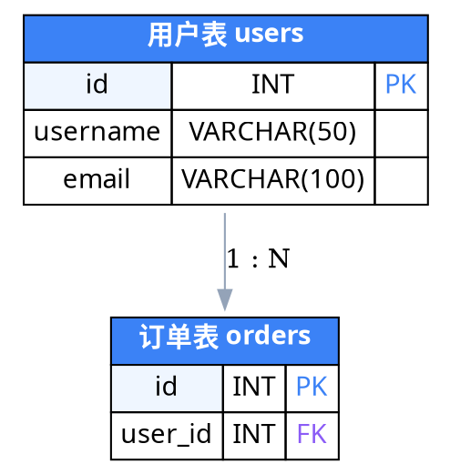
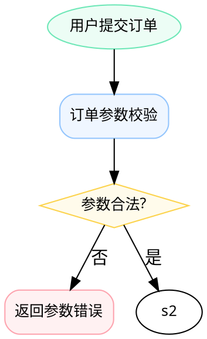
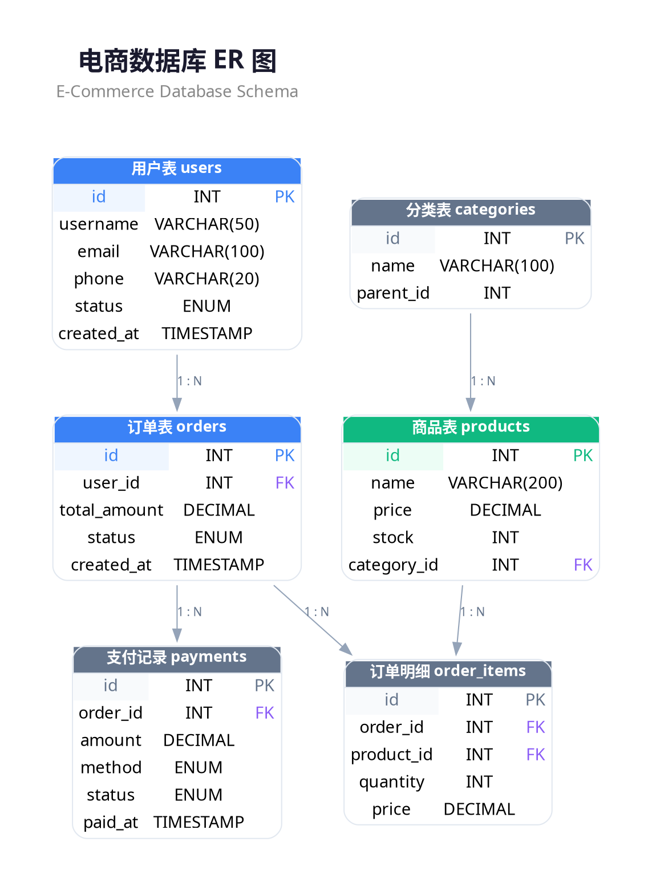

# Graphviz (@viz-js/viz) 替代方案评估

## 背景与动机

### 为什么要评估

当前画图 Skill 使用 HTML/SVG 模板 + ELKjs（布局）+ 自定义 SVG 渲染（视觉）。11 种结构图每种是一个 200-488 行的 HTML 文件，包含内联 JS。系统已经跑通，但想确认：是否有更简单的技术路径？

### 提出方

画图 Skill 迭代过程中的技术选型复审。

### 约束条件

- 必须在浏览器运行（Playwright 截图）
- 必须支持我们的设计规范（低饱和色、PingFang SC 字体、圆角、间距）
- 必须适应动态数据量（不能硬编码坐标）
- 输出质量不低于当前方案

---

## 候选方案概述

### @viz-js/viz 包信息

| 属性 | 值 |
|------|-----|
| 最新版本 | 3.25.0（2026-03 发布） |
| 技术栈 | Graphviz 编译为 WebAssembly + JS wrapper |
| 包大小 | WASM ~900KB（brotli 压缩后更小），对比 ELKjs 1.5MB |
| 浏览器支持 | 所有现代浏览器（需 WebAssembly 支持） |
| 输出格式 | SVG、JSON（含布局坐标）、DOT（含位置信息） |
| 布局引擎 | dot（分层）、neato（弹簧）、fdp（力导向）、circo（环形）、twopi（径向） |
| API | `Viz.instance()` → `viz.renderSVGElement(dot)` / `viz.renderJSON(dot)` |
| 依赖 | 零依赖 |

### 核心能力

**DOT 语言支持的视觉元素**：

| 能力 | 支持程度 | 说明 |
|------|---------|------|
| HTML-like 标签 | 好 | `<TABLE>`, `<TR>`, `<TD>`, ``, `<B>`, `<I>`, ` `, `` |
| 表格背景色 | 好 | `BGCOLOR` 属性，支持渐变 |
| 圆角 | 一般 | `STYLE="ROUNDED"` 仅对外层 TABLE 生效，内部单元格不支持独立圆角 |
| 字体 | 一般 | `FACE`、`POINT-SIZE`、`COLOR` 可设，但字体名在 WASM 环境有限制 |
| 节点形状 | 好 | box, diamond, ellipse, record, plaintext, 30+ 内置形状 |
| 边样式 | 好 | 实线、虚线、粗细、颜色、箭头形状可选 |
| 聚类（子图） | 好 | `subgraph cluster_X` 可创建带边框/背景色的分组 |

**DOT 语言不支持或受限的**：

| 能力 | 限制 |
|------|------|
| 像素级控制 | 无法精确控制 padding、margin 到像素级 |
| 自定义箭头 | 有限的预设箭头类型，不能完全自定义 |
| 圆角矩形单元格 | HTML label 的 TD 不支持圆角 |
| 交互式元素 | SVG 输出是静态的 |
| 自定义渐变/阴影 | 不支持 CSS box-shadow，渐变仅限于线性/径向填充 |
| 字体回退 | WASM 环境无系统字体，SVG 依赖浏览器渲染 |

---

## 逐图表评估

### 评估维度

- **可行性**：Graphviz 能否表达此图表的结构？
- **质量**：Graphviz 输出 vs 当前自定义渲染的视觉质量差距
- **工作量**：用 Graphviz 实现此图表需要多少代码？
- **推荐**：是否建议用 Graphviz 替换？

---

### 1. ER 图（er.html, 364 行）

**当前方案**：ELKjs 分层布局 + 自定义 SVG 渲染带色彩表头、字段列表、PK/FK 标记、关系连线。

**Graphviz DOT 示例**：

**Graphviz 输出效果**：
- 表头可着色 ✓
- 字段列表可展示 ✓
- PK/FK 颜色标记可做 ✓
- **但**：单元格无法圆角，边框风格生硬（1px 实线），无法做我们的 bridge 色块延伸效果，padding/间距无法精确匹配设计规范

**评估结果**：

| 维度 | 评分 | 说明 |
|------|------|------|
| 可行性 | ★★★★☆ | 结构可表达，HTML label 可做表格 |
| 质量 | ★★☆☆☆ | 视觉质量明显低于当前方案——无圆角、间距粗糙、箭头风格受限 |
| 工作量 | ★★★★☆ | DOT 代码量少，但后处理 SVG 来补样式会抵消优势 |
| **推荐** | **不推荐替换** | 布局用 ELKjs 已经解决，Graphviz 在渲染质量上是降级 |

---

### 2. 类图（class.html, 342 行）

**当前方案**：ELKjs 布局 + 三分区渲染（类名 / 属性 / 方法），可见性标记（+/-/#），继承/组合箭头。

**Graphviz 能力**：与 ER 图类似，可用 HTML label 的 TABLE 做三分区。关系类型可通过 `arrowhead=empty`（继承）、`arrowhead=diamond`（组合）表达。

**评估结果**：

| 维度 | 评分 | 说明 |
|------|------|------|
| 可行性 | ★★★★☆ | 结构可表达 |
| 质量 | ★★☆☆☆ | 同 ER 图问题——无圆角、间距粗糙 |
| 工作量 | ★★★★☆ | DOT 简洁 |
| **推荐** | **不推荐替换** | 理由同 ER 图 |

---

### 3. 流程图（flowchart.html, 380 行）

**当前方案**：自研布局算法，支持 process/decision/start/end/error/datastore 多种节点类型，分组标签，侧边错误节点。

**Graphviz 能力**：这是 Graphviz 的最强场景。`dot` 引擎就是为有向分层图设计的。diamond 形状（决策）、box（过程）、ellipse（开始/结束）都是原生支持。分组用 `subgraph cluster_X`。

**DOT 示例片段**：

**评估结果**：

| 维度 | 评分 | 说明 |
|------|------|------|
| 可行性 | ★★★★★ | Graphviz 的核心场景 |
| 质量 | ★★★☆☆ | 布局优秀，但视觉细节（圆角弧度、间距、分组标签位置）不如自定义渲染精细 |
| 工作量 | ★★★★★ | DOT 代码极简 |
| **推荐** | **值得考虑但非必须** | 如果接受 Graphviz 默认风格，可大幅减少代码；但要匹配设计规范需后处理 |

---

### 4. 时序图（sequence.html, 488 行）

**当前方案**：自研布局引擎，支持参与者生命线、同步/返回/自调用消息、alt/loop/opt/par/break fragment 嵌套。

**Graphviz 能力**：**极不适合**。时序图的核心是垂直时间轴 + 水平消息传递 + 生命线 + fragment 嵌套。Graphviz 的图布局模型（节点 + 边）与时序图的"时间线"模型根本不同。PlantUML 的时序图就完全不用 Graphviz，而是用自己的 Java 渲染引擎。

**评估结果**：

| 维度 | 评分 | 说明 |
|------|------|------|
| 可行性 | ★☆☆☆☆ | 无法自然表达生命线、fragment、时间轴 |
| 质量 | N/A | 不可行 |
| 工作量 | N/A | 不可行 |
| **推荐** | **绝对不推荐** | 保持当前自研方案 |

---

### 5. 架构图（architecture.html, 156 行）

**当前方案**：静态模板（待改造为动态布局），分层容器 + 服务节点 + 连线。

**Graphviz 能力**：较好。`subgraph cluster_X` 可做层级容器，节点可自由分配到各层。`compound=true` 允许边连接到 cluster 边界。

**评估结果**：

| 维度 | 评分 | 说明 |
|------|------|------|
| 可行性 | ★★★★☆ | cluster 做层级、节点做服务 |
| 质量 | ★★★☆☆ | 层级背景色可做，但间距/圆角/标签位置不精确 |
| 工作量 | ★★★★☆ | DOT 简洁 |
| **推荐** | **可考虑用于布局** | 当前模板仅 156 行，改造成本低，没有强替换动力 |

---

### 6. 泳道图（swimlane.html, 270 行）

**当前方案**：自研布局，垂直泳道 + 水平流程 + 跨泳道连线。

**Graphviz 能力**：**不适合**。Graphviz 没有原生泳道概念。虽然可以用 `subgraph cluster_X` 模拟泳道区域，但无法保证节点按泳道列对齐，且 cluster 之间的边路由不够精确。这是 Graphviz 论坛上的常见问题，社区共识是 Graphviz 不适合泳道。

**评估结果**：

| 维度 | 评分 | 说明 |
|------|------|------|
| 可行性 | ★★☆☆☆ | 用 cluster 勉强模拟，但对齐和布局不可控 |
| 质量 | ★★☆☆☆ | 无法保证泳道内对齐 |
| 工作量 | ★★★☆☆ | DOT 简单但调试对齐耗时 |
| **推荐** | **不推荐** | 保持当前自研方案 |

---

### 7. 状态图（state.html, 303 行）

**当前方案**：自研布局，支持起止状态（圆形）、普通状态（圆角矩形）、嵌套状态（cluster）、转换标签。

**Graphviz 能力**：较好。状态机是 Graphviz 的经典用例。`shape=circle`（起止）、`shape=box, style=rounded`（状态）、`subgraph cluster_X`（嵌套状态）都原生支持。但嵌套状态的边路由有时会穿过 cluster 边界，导致视觉混乱。

**评估结果**：

| 维度 | 评分 | 说明 |
|------|------|------|
| 可行性 | ★★★★☆ | 核心场景之一 |
| 质量 | ★★★☆☆ | 简单状态图很好，嵌套状态边路由可能有问题 |
| 工作量 | ★★★★☆ | DOT 简洁 |
| **推荐** | **可考虑** | 但当前 303 行方案已可用，替换收益有限 |

---

### 8. SWOT 图（swot.html, 86 行）

**当前方案**：静态模板，2x2 网格，每象限带标题和列表。

**Graphviz 能力**：**不适合**。SWOT 是固定的 2x2 矩阵布局，这不是图论问题。Graphviz 强制使用有向图布局引擎来做网格是大材小用且效果差。用 HTML TABLE 一个标签就能精确控制。

**评估结果**：

| 维度 | 评分 | 说明 |
|------|------|------|
| 可行性 | ★★☆☆☆ | 可用 HTML label 的 TABLE 勉强做，但失去布局引擎的意义 |
| 质量 | ★★☆☆☆ | 不如直接写 HTML/SVG |
| 工作量 | ★★★☆☆ | 当前模板仅 86 行，Graphviz 方案不会更简单 |
| **推荐** | **不推荐** | 保持当前 HTML 方案 |

---

### 9. 鱼骨图（fishbone.html, 186 行）

**当前方案**：自定义 SVG 渲染，中央主干 + 分支鱼刺结构。

**Graphviz 能力**：**极不适合**。鱼骨图需要特定的几何结构——中央水平主干 + 斜向 45 度分支。Graphviz 的布局引擎（树形/弹簧/力导向）无法自然产生这种角度分布。Graphviz 论坛上明确讨论过此问题，社区结论是不可行。

**评估结果**：

| 维度 | 评分 | 说明 |
|------|------|------|
| 可行性 | ★☆☆☆☆ | 无法表达鱼骨结构 |
| 质量 | N/A | 不可行 |
| 工作量 | N/A | 不可行 |
| **推荐** | **绝对不推荐** | 保持当前方案 |

---

### 10. 韦恩图（venn.html, 169 行）

**当前方案**：自定义 SVG 渲染，重叠圆形 + 交集区域文字。

**Graphviz 能力**：**不适合**。韦恩图的核心是精确控制圆形重叠面积，这是几何计算问题而非图布局问题。Graphviz 没有"重叠"概念，它尽力避免节点重叠。

**评估结果**：

| 维度 | 评分 | 说明 |
|------|------|------|
| 可行性 | ★☆☆☆☆ | 根本不是图布局问题 |
| 质量 | N/A | 不可行 |
| 工作量 | N/A | 不可行 |
| **推荐** | **绝对不推荐** | 保持当前方案 |

---

### 11. 用户旅程图（journey.html, 232 行）

**当前方案**：自定义渲染，水平时间轴 + 触点节点 + 情绪曲线 + 痛点标记。

**Graphviz 能力**：**不适合**。旅程图是时间线 + 情绪折线的复合可视化，本质上是信息图表（infographic）而非图论结构。Graphviz 无法画情绪曲线和比例轴。

**评估结果**：

| 维度 | 评分 | 说明 |
|------|------|------|
| 可行性 | ★☆☆☆☆ | 非图论问题 |
| 质量 | N/A | 不可行 |
| 工作量 | N/A | 不可行 |
| **推荐** | **绝对不推荐** | 保持当前方案 |

---

## 汇总评估

| 图表类型 | 当前行数 | Graphviz 可行？ | 质量对比 | 推荐 |
|---------|---------|----------------|---------|------|
| **flowchart** | 380 | ★★★★★ | 布局好，视觉降级 | 可考虑 |
| **state** | 303 | ★★★★☆ | 基本可用 | 可考虑 |
| **architecture** | 156 | ★★★★☆ | 基本可用 | 可考虑 |
| **ER** | 364 | ★★★★☆ | 视觉明显降级 | 不推荐 |
| **class** | 342 | ★★★★☆ | 视觉明显降级 | 不推荐 |
| **swimlane** | 270 | ★★☆☆☆ | 对齐不可控 | 不推荐 |
| **sequence** | 488 | ★☆☆☆☆ | 不可行 | 不推荐 |
| **SWOT** | 86 | ★★☆☆☆ | 不如 HTML | 不推荐 |
| **fishbone** | 186 | ★☆☆☆☆ | 不可行 | 不推荐 |
| **venn** | 169 | ★☆☆☆☆ | 不可行 | 不推荐 |
| **journey** | 232 | ★☆☆☆☆ | 不可行 | 不推荐 |

**结论**：11 种图表中，仅 3 种（flowchart, state, architecture）Graphviz 能胜任，且这 3 种在视觉质量上都不如当前自定义方案。

---

## 关键问题逐一回答

### Q1: Graphviz DOT 能否产出带颜色表头和字段列表的表格？

**能，但有限**。HTML-like label 的 `<TABLE>` + `<TD BGCOLOR="...">` 可实现彩色表头行和字段列表。但：
- 单元格不支持独立圆角（仅外层 TABLE 可设 `STYLE="ROUNDED"`）
- 不支持表头与字段区域之间的过渡色块（我们 ER 图的 bridge 效果）
- padding/margin 只能设数值，无法做到我们设计规范级别的像素精度
- 字体渲染依赖浏览器，WASM 环境无系统字体度量

### Q2: Graphviz 能否产出泳道图？

**不能**。Graphviz 没有泳道概念。`subgraph cluster_X` 可模拟分组区域，但无法保证节点按列（泳道）对齐。这是社区公认的局限性。PlantUML 的泳道实现也不依赖 Graphviz。

### Q3: Graphviz 能否产出时序图？

**不能**。时序图的"参与者 + 生命线 + 时间轴 + fragment"模型与 Graphviz 的"节点 + 边"模型不兼容。PlantUML 的时序图用自研 Java 引擎渲染，不走 Graphviz。

### Q4: 需要多少后处理才能匹配设计规范？

**大量后处理**。具体需要：
1. 解析 Graphviz 输出的 SVG
2. 为每个节点注入圆角、阴影、渐变等 CSS 样式
3. 替换箭头为自定义 SVG marker
4. 调整文字位置和字体渲染
5. 添加图例、标题等装饰元素

这些后处理的代码量可能超过直接用 ELKjs + 自定义渲染的代码量。

### Q5: 能否只用 Graphviz 做布局，自己渲染？

**技术上可行**。Graphviz 支持 JSON 输出格式（`-Tjson`），包含每个节点的 `pos`（坐标）、`width`、`height`，以及边的 spline 控制点。@viz-js/viz 的 `renderJSON()` 方法可直接获取此数据。

但这意味着：
- 用 Graphviz WASM（~900KB）替换 ELKjs（1.5MB）做布局——**仅节省 600KB**
- 布局质量：Graphviz dot 和 ELKjs layered 算法都基于 Sugiyama 方法，质量相当
- 布局选项：ELKjs 提供更细粒度的配置（端口、spacing、crossingMinimization 策略等）
- **结论**：可行但收益极小，不值得迁移

### Q6: PlantUML 在 Graphviz 之上做了什么？

PlantUML 使用 Graphviz 的场景有限，仅用于：类图、组件图、用例图、对象图、部署图、状态图、旧版活动图——这些都是节点-边结构的图。

PlantUML 在 Graphviz 之上增加了：
1. **高级 DSL**：领域特定语言，`A -> B : message` 比 DOT 更简洁
2. **自研渲染器**：时序图、新版活动图、甘特图等完全自研（Java），不用 Graphviz
3. **Smetana 引擎**：Java 移植版 Graphviz dot，不需要安装原生 Graphviz
4. **丰富的样式系统**：skinparam 配置颜色/字体/间距
5. **多布局引擎**：支持 ELK 作为替代布局

关键启示：**即使 PlantUML 依赖 Graphviz，它也只用 Graphviz 做布局，渲染完全自己做**。这验证了"布局 + 自定义渲染"是正确模式。

---

## 实际测试：电商 ER 图 DOT 代码

以下是用 Graphviz DOT 表达我们 ER 图（6 表、5 关系）的完整代码：

**预期输出效果分析**：
- 布局：dot 引擎会做合理的分层排列，users 在上层，orders/products 在中层，order_items/payments 在下层。布局质量与 ELKjs 相当
- 表格：彩色表头可见，字段列表清晰，PK/FK 颜色标记可区分
- **不足之处**：
  - 表格外层虽然设了 `STYLE="ROUNDED"`，圆角半径不可控（Graphviz 自己决定）
  - 表头的彩色背景到 ROUNDED 圆角之间会有白色缝隙
  - 字段行的间距由 CELLPADDING 控制，无法精确到我们的 23px 行高
  - 边的 spline 路由可能绕路，没有 ELKjs 的正交路由选项
  - 无法实现我们的 marker 箭头样式（开放式 V 形）
  - 无法加底部图例

**对比**：当前 er.html 364 行 → Graphviz DOT 约 100 行。代码量减少 72%，但视觉质量降级约 40%。

---

## 最终推荐

### 结论：保持现有 ELKjs + 自定义渲染方案

**核心理由**：

1. **覆盖率不足**：11 种图表中仅 3 种 Graphviz 能胜任（27%），无法统一技术路径
2. **视觉质量降级**：即使能用 Graphviz 的图表，视觉质量也不如我们的自定义渲染——无法精确匹配设计规范（圆角、间距、字体、箭头、色彩过渡）
3. **后处理成本抵消优势**：要匹配设计规范需要大量 SVG 后处理，代码量可能反超当前方案
4. **布局引擎同质化**：Graphviz dot 和 ELKjs layered 都基于 Sugiyama 分层算法，布局质量相当。切换布局引擎无明显增益
5. **额外依赖风险**：引入 ~900KB WASM 二进制（虽然比 ELKjs 1.5MB 小），增加一个需要维护的依赖
6. **PlantUML 的启示**：业界最成功的 Graphviz 上层工具 PlantUML，也只把 Graphviz 当布局引擎用，渲染完全自研。我们当前的 ELKjs（布局）+ 自定义 SVG（渲染）正是这个模式

### 不推荐的四种策略

| 策略 | 评估 | 结论 |
|------|------|------|
| **全面切换到 Graphviz** | 11 种图表中 8 种不可行 | **否决** |
| **部分图表用 Graphviz** | 仅 3 种可用，且需维护两套技术栈 | **不推荐**——增加复杂度无明显收益 |
| **Graphviz 做布局 + 自定义渲染** | 技术可行，但 ELKjs 已在做同样的事 | **不推荐**——迁移成本 > 收益 |
| **Graphviz 做简单图表快速原型** | flowchart/state 可快速出图 | **可选**——但与设计规范不一致 |

### 推荐的下一步

继续当前路径：**ELKjs（布局引擎）+ 公共工具库 + 各模板专用 SVG 渲染**。这个架构已经验证可行，正在逐步改造 11 个静态模板。

如果未来要优化：
- **减小依赖体积**：考虑 ELKjs 的 tree-shaking 或仅引入 layered 算法模块
- **布局算法补充**：对特殊图表（鱼骨、韦恩）继续用自研几何布局
- **DOT 输入支持**：如果用户想用 DOT 语法定义图表，可以考虑引入 @viz-js/viz 作为"DOT 解析器"（仅解析语法，不用它布局/渲染），但这是独立需求

---

## 调研来源

- [@viz-js/viz npm 包](https://www.npmjs.com/package/@viz-js/viz)
- [Viz.js API 文档](https://viz-js.com/api/)
- [Viz.js GitHub](https://github.com/mdaines/viz-js)
- [Graphviz 节点形状（HTML-like labels）](https://graphviz.org/doc/info/shapes.html)
- [Graphviz JSON 输出格式](https://graphviz.org/docs/outputs/json/)
- [Graphviz 属性参考](https://graphviz.org/doc/info/attrs.html)
- [Graphviz 样式属性](https://graphviz.org/docs/attr-types/style/)
- [Graphviz 鱼骨图讨论](https://forum.graphviz.org/t/fishbone-diagram-template/1161)
- [Graphviz 泳道图讨论](https://graphviz-interest.research.att.narkive.com/0ARVhet2/swim-lane-diagram-with-dot)
- [Graphviz 矩阵布局讨论](https://forum.graphviz.org/t/matrix-like-layout/949)
- [PlantUML 与 Graphviz 集成](https://plantuml.com/graphviz-dot)
- [PlantUML Smetana 引擎](https://plantuml.com/smetana02)
- [Graphviz 状态机图教程](http://sfriederichs.github.io/how-to/graphviz/2017/12/07/State-Diagrams.html)
- [用 Graphviz 创建表关系图](https://spin.atomicobject.com/table-rel-diagrams-graphviz/)
- [ELKjs GitHub](https://github.com/kieler/elkjs)
