# DSL 渲染测试 — Mermaid 全覆盖

> 覆盖 Mermaid 支持的全部图表类型，验证 preview-md 的渲染和主题配色效果。

---

## 一、结构图

### 1. Flowchart 流程图

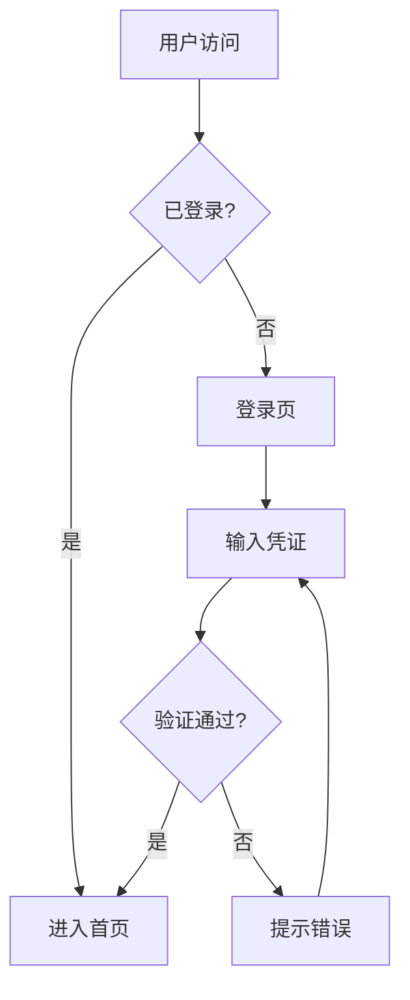
```mermaid
flowchart TD
    A[用户访问] --> B{已登录?}
    B -->|是| C[进入首页]
    B -->|否| D[登录页]
    D --> E[输入凭证]
    E --> F{验证通过?}
    F -->|是| C
    F -->|否| G[提示错误]
    G --> E
```

### 2. Sequence 时序图

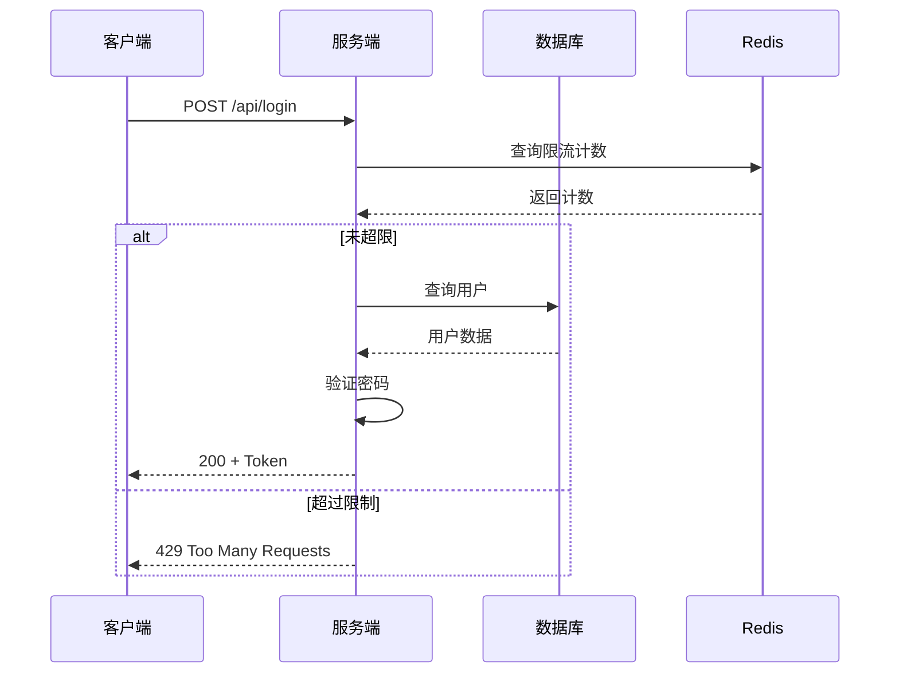
```mermaid
sequenceDiagram
    participant C as 客户端
    participant S as 服务端
    participant DB as 数据库
    participant Cache as Redis

    C->>S: POST /api/login
    S->>Cache: 查询限流计数
    Cache-->>S: 返回计数
    alt 未超限
        S->>DB: 查询用户
        DB-->>S: 用户数据
        S->>S: 验证密码
        S-->>C: 200 + Token
    else 超过限制
        S-->>C: 429 Too Many Requests
    end
```

### 3. Class 类图

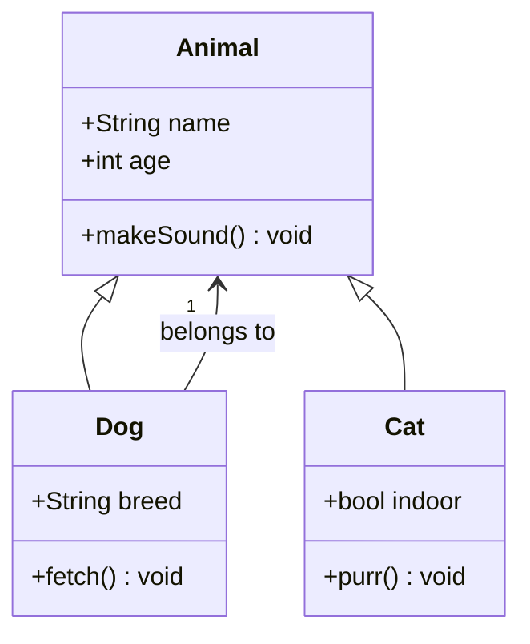
```mermaid
classDiagram
    class Animal {
        +String name
        +int age
        +makeSound() void
    }
    class Dog {
        +String breed
        +fetch() void
    }
    class Cat {
        +bool indoor
        +purr() void
    }
    Animal <|-- Dog
    Animal <|-- Cat
    Dog --> "1" Animal : belongs to
```

### 4. State 状态图

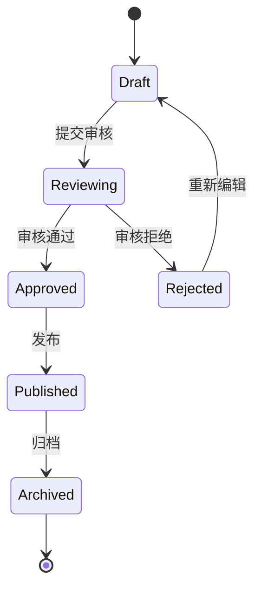
```mermaid
stateDiagram-v2
    [*] --> Draft
    Draft --> Reviewing : 提交审核
    Reviewing --> Approved : 审核通过
    Reviewing --> Rejected : 审核拒绝
    Rejected --> Draft : 重新编辑
    Approved --> Published : 发布
    Published --> Archived : 归档
    Archived --> [*]
```

### 5. ER 图

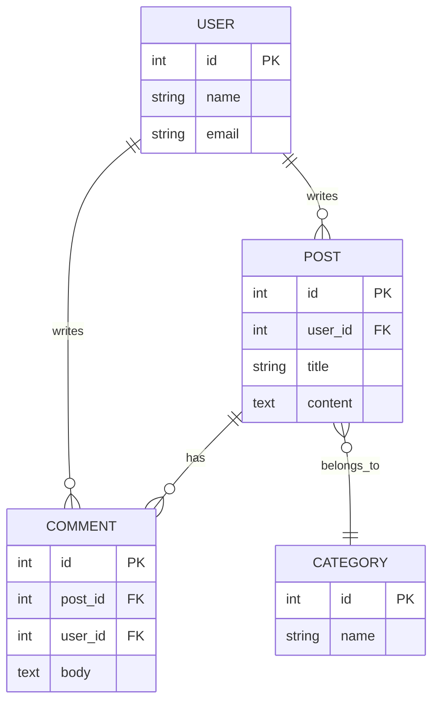
```mermaid
erDiagram
    USER ||--o{ POST : writes
    USER ||--o{ COMMENT : writes
    POST ||--o{ COMMENT : has
    POST }o--|| CATEGORY : belongs_to

    USER {
        int id PK
        string name
        string email
    }
    POST {
        int id PK
        int user_id FK
        string title
        text content
    }
    COMMENT {
        int id PK
        int post_id FK
        int user_id FK
        text body
    }
    CATEGORY {
        int id PK
        string name
    }
```

### 6. Gantt 甘特图

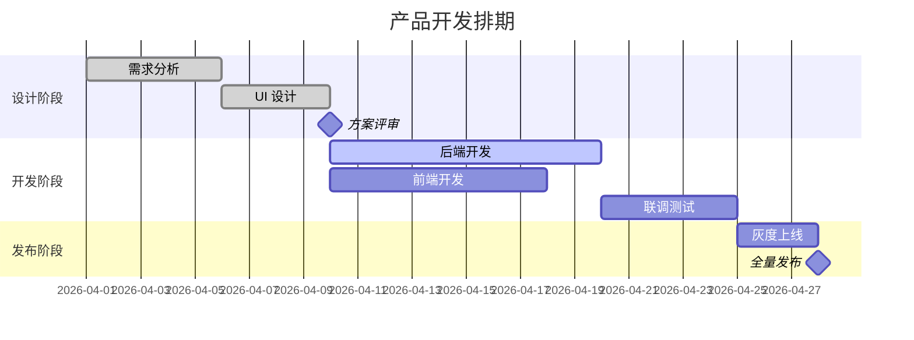
```mermaid
gantt
    title 产品开发排期
    dateFormat YYYY-MM-DD
    section 设计阶段
        需求分析      :done, a1, 2026-04-01, 5d
        UI 设计       :done, a2, after a1, 4d
        方案评审      :milestone, a3, after a2, 0d
    section 开发阶段
        后端开发      :active, b1, after a3, 10d
        前端开发      :b2, after a3, 8d
        联调测试      :b3, after b1, 5d
    section 发布阶段
        灰度上线      :c1, after b3, 3d
        全量发布      :milestone, c2, after c1, 0d
```

### 7. Mindmap 思维导图

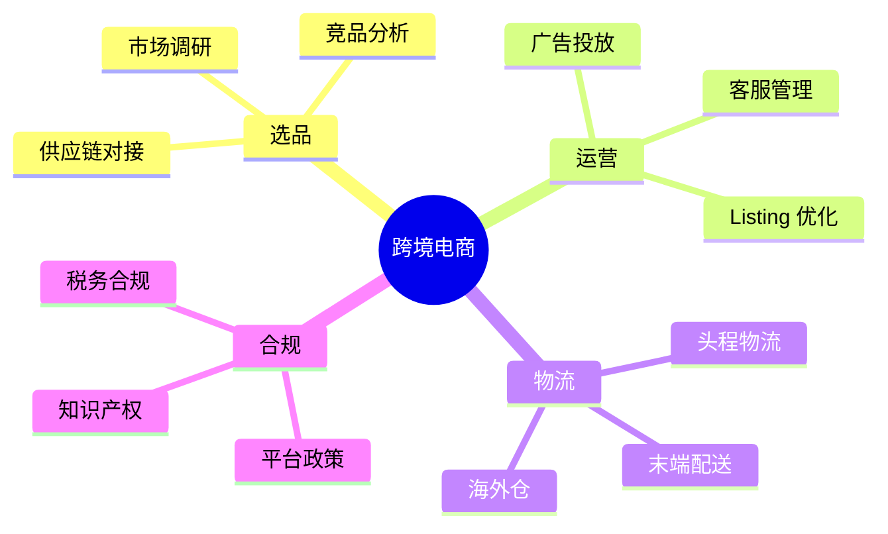
```mermaid
mindmap
  root((跨境电商))
    选品
      市场调研
      竞品分析
      供应链对接
    运营
      Listing 优化
      广告投放
      客服管理
    物流
      头程物流
      海外仓
      末端配送
    合规
      平台政策
      知识产权
      税务合规
```

### 8. Timeline 时间线

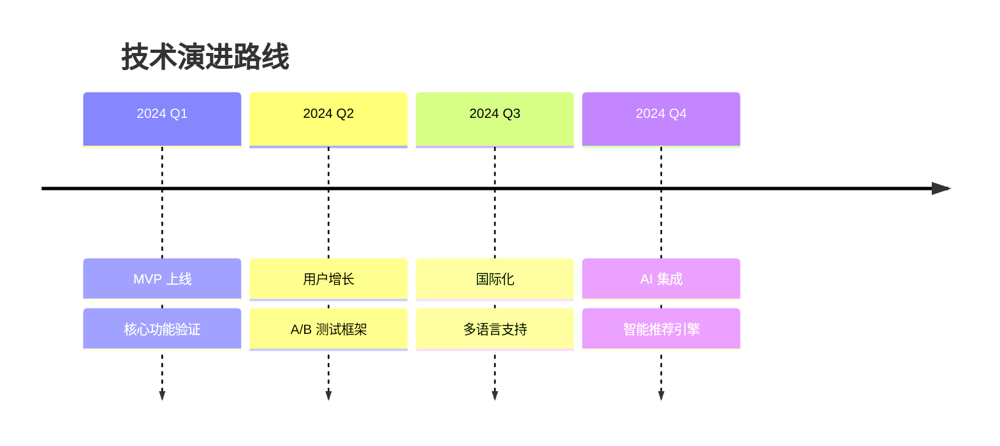
```mermaid
timeline
    title 技术演进路线
    2024 Q1 : MVP 上线
             : 核心功能验证
    2024 Q2 : 用户增长
             : A/B 测试框架
    2024 Q3 : 国际化
             : 多语言支持
    2024 Q4 : AI 集成
             : 智能推荐引擎
```

### 9. C4 架构图

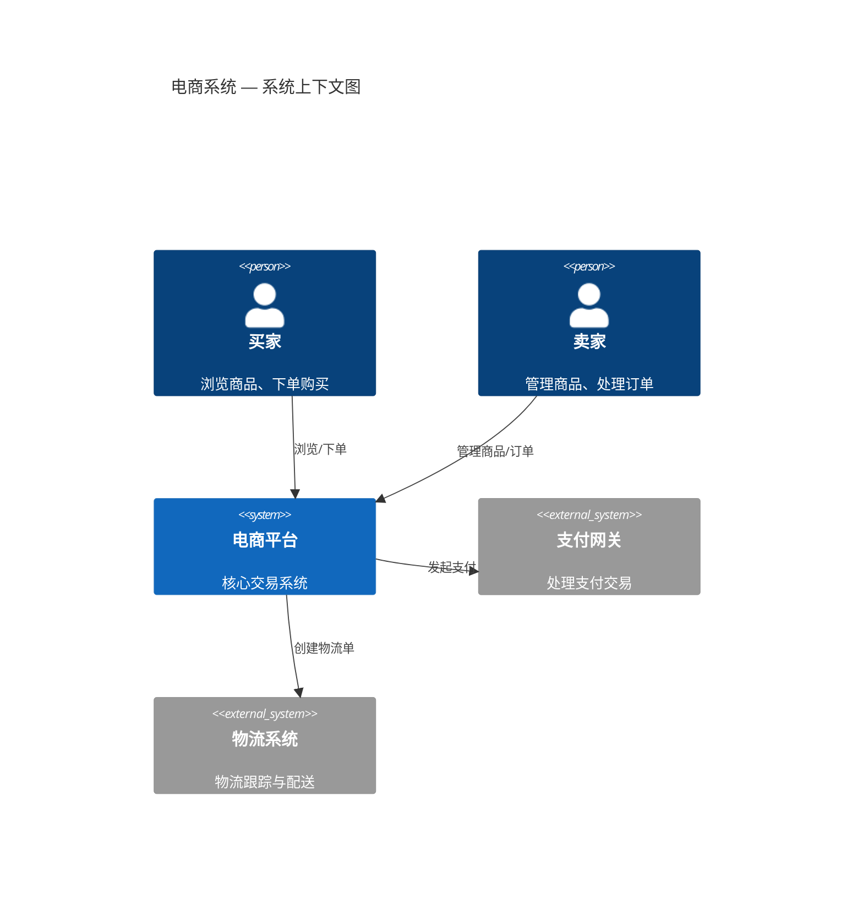
```mermaid
C4Context
    title 电商系统 — 系统上下文图

    Person(customer, "买家", "浏览商品、下单购买")
    Person(seller, "卖家", "管理商品、处理订单")

    System(ecommerce, "电商平台", "核心交易系统")
    System_Ext(payment, "支付网关", "处理支付交易")
    System_Ext(logistics, "物流系统", "物流跟踪与配送")

    Rel(customer, ecommerce, "浏览/下单")
    Rel(seller, ecommerce, "管理商品/订单")
    Rel(ecommerce, payment, "发起支付")
    Rel(ecommerce, logistics, "创建物流单")
```

### 10. Sankey 桑基图

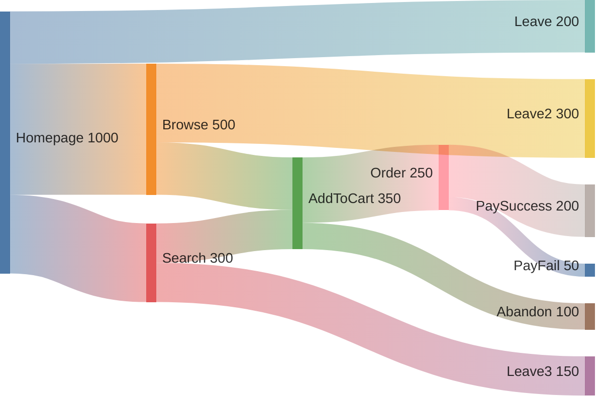
```mermaid
sankey-beta

Homepage,Browse,500
Homepage,Search,300
Homepage,Leave,200
Browse,AddToCart,200
Browse,Leave2,300
Search,AddToCart,150
Search,Leave3,150
AddToCart,Order,250
AddToCart,Abandon,100
Order,PaySuccess,200
Order,PayFail,50
```

### 11. Journey 旅程图

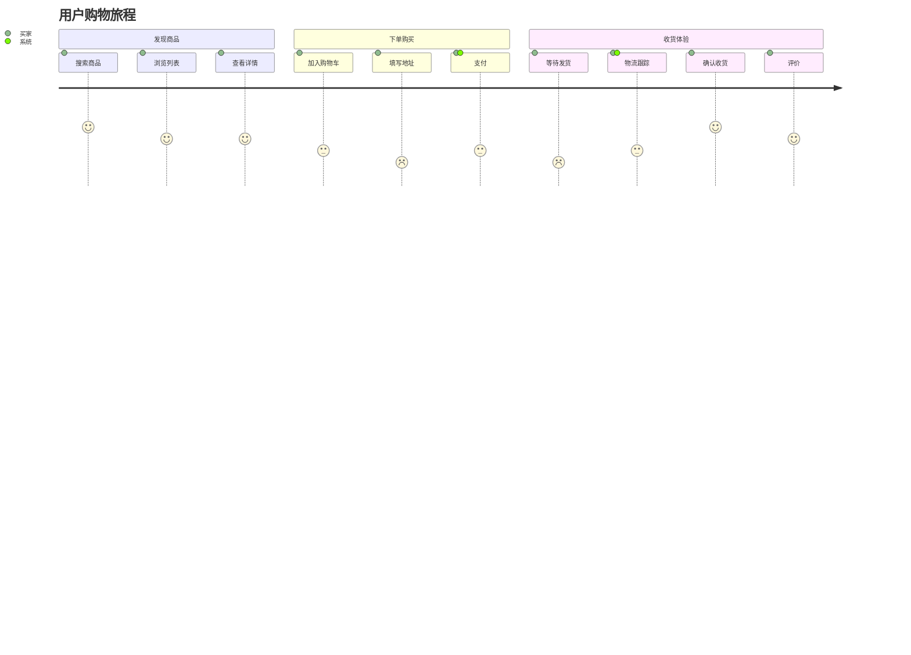
```mermaid
journey
    title 用户购物旅程
    section 发现商品
      搜索商品: 5: 买家
      浏览列表: 4: 买家
      查看详情: 4: 买家
    section 下单购买
      加入购物车: 3: 买家
      填写地址: 2: 买家
      支付: 3: 买家, 系统
    section 收货体验
      等待发货: 2: 买家
      物流跟踪: 3: 买家, 系统
      确认收货: 5: 买家
      评价: 4: 买家
```

---

## 二、结构图（Flowchart 子图模式）

### 12. Architecture 架构图

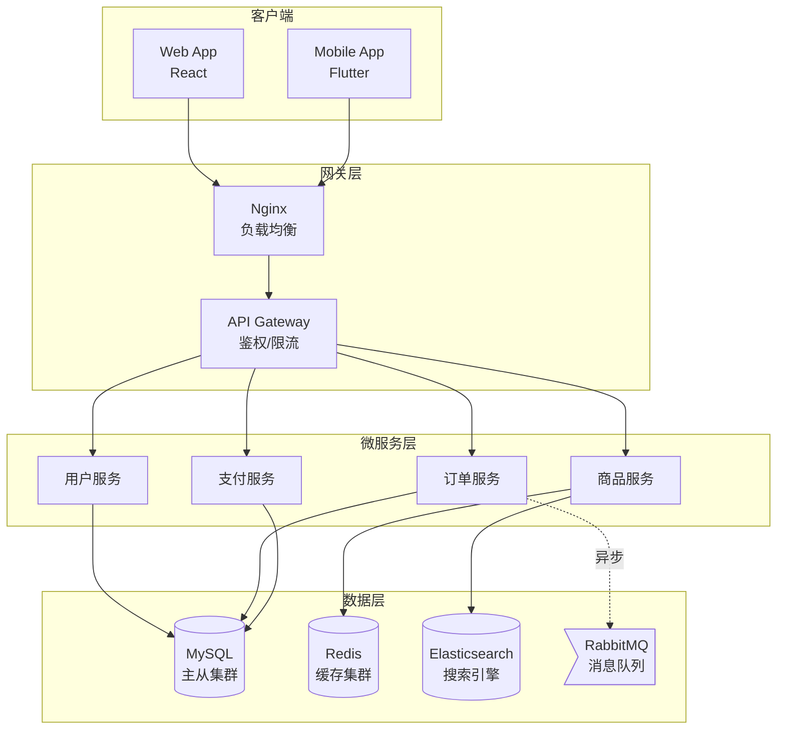
```mermaid
flowchart TD
    subgraph client["客户端"]
        web[Web App<br/>React]
        mobile[Mobile App<br/>Flutter]
    end

    subgraph gateway["网关层"]
        nginx[Nginx<br/>负载均衡]
        api_gw[API Gateway<br/>鉴权/限流]
    end

    subgraph services["微服务层"]
        user_svc[用户服务]
        order_svc[订单服务]
        product_svc[商品服务]
        pay_svc[支付服务]
    end

    subgraph data["数据层"]
        mysql[(MySQL<br/>主从集群)]
        redis[(Redis<br/>缓存集群)]
        es[(Elasticsearch<br/>搜索引擎)]
        mq>RabbitMQ<br/>消息队列]
    end

    web --> nginx
    mobile --> nginx
    nginx --> api_gw
    api_gw --> user_svc
    api_gw --> order_svc
    api_gw --> product_svc
    api_gw --> pay_svc
    user_svc --> mysql
    order_svc --> mysql
    order_svc -.->|异步| mq
    product_svc --> es
    product_svc --> redis
    pay_svc --> mysql
```

### 13. Swimlane 泳道图

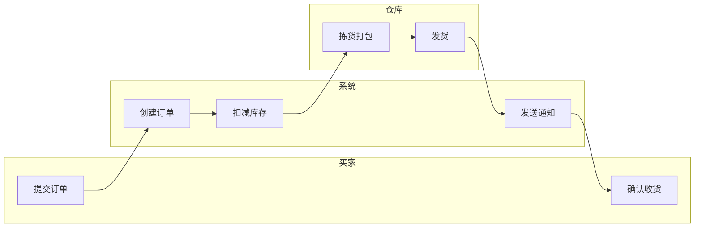
```mermaid
flowchart LR
    subgraph buyer["买家"]
        c1[提交订单]
        c2[确认收货]
    end

    subgraph system["系统"]
        s1[创建订单]
        s2[扣减库存]
        s3[发送通知]
    end

    subgraph warehouse["仓库"]
        w1[拣货打包]
        w2[发货]
    end

    c1 --> s1 --> s2 --> w1 --> w2 --> s3 --> c2
```

### 14. Network 网络图

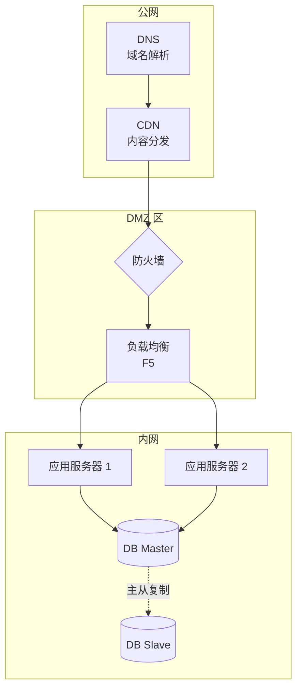
```mermaid
flowchart TD
    subgraph public["公网"]
        cdn[CDN<br/>内容分发]
        dns[DNS<br/>域名解析]
    end

    subgraph dmz["DMZ 区"]
        fw{防火墙}
        lb[负载均衡<br/>F5]
    end

    subgraph internal["内网"]
        app1[应用服务器 1]
        app2[应用服务器 2]
        db_master[(DB Master)]
        db_slave[(DB Slave)]
    end

    dns --> cdn --> fw
    fw --> lb
    lb --> app1
    lb --> app2
    app1 --> db_master
    app2 --> db_master
    db_master -.->|主从复制| db_slave
```

### 15. Decision Tree 决策树

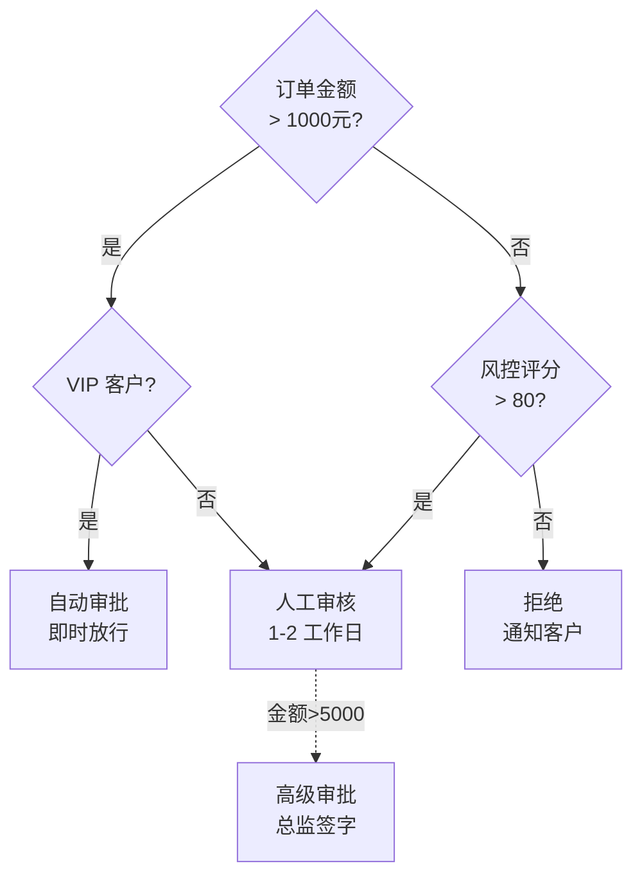
```mermaid
flowchart TD
    start{订单金额<br/>> 1000元?}
    vip{VIP 客户?}
    risk{风控评分<br/>> 80?}

    auto[自动审批<br/>即时放行]
    manual[人工审核<br/>1-2 工作日]
    reject[拒绝<br/>通知客户]
    senior[高级审批<br/>总监签字]

    start -->|是| vip
    start -->|否| risk
    vip -->|是| auto
    vip -->|否| manual
    risk -->|是| manual
    risk -->|否| reject
    manual -.->|金额>5000| senior
```

### 16. Dataflow 数据流图

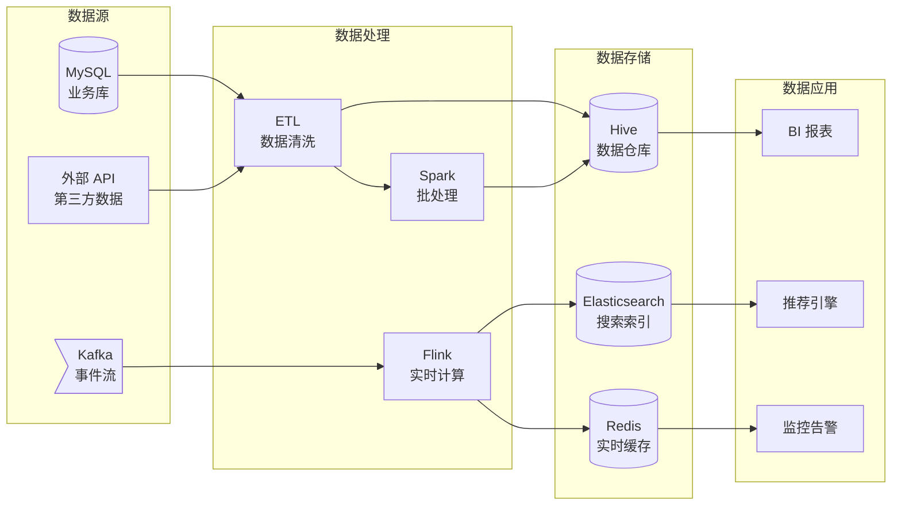
```mermaid
flowchart LR
    subgraph source["数据源"]
        mysql_src[(MySQL<br/>业务库)]
        kafka>Kafka<br/>事件流]
        api[外部 API<br/>第三方数据]
    end

    subgraph process["数据处理"]
        flink[Flink<br/>实时计算]
        spark[Spark<br/>批处理]
        etl[ETL<br/>数据清洗]
    end

    subgraph storage["数据存储"]
        hive[(Hive<br/>数据仓库)]
        es[(Elasticsearch<br/>搜索索引)]
        redis[(Redis<br/>实时缓存)]
    end

    subgraph output["数据应用"]
        bi[BI 报表]
        recommend[推荐引擎]
        monitor[监控告警]
    end

    mysql_src --> etl
    kafka --> flink
    api --> etl
    etl --> hive
    etl --> spark
    flink --> redis
    flink --> es
    spark --> hive
    hive --> bi
    es --> recommend
    redis --> monitor
```

### 17. Orgchart 组织结构图

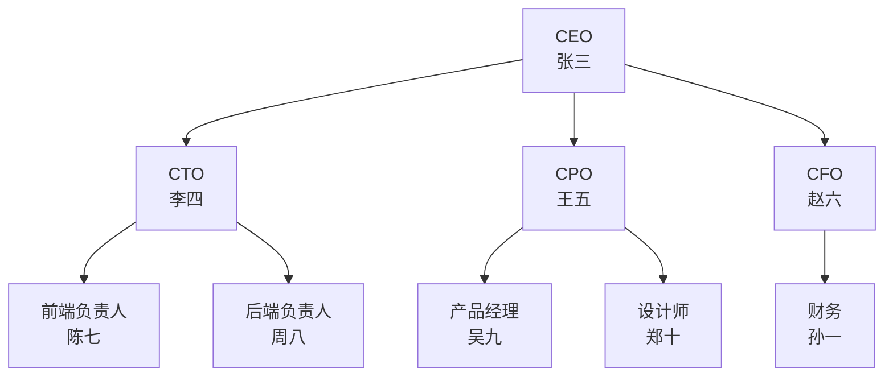
```mermaid
flowchart TD
    ceo[CEO<br/>张三]

    cto[CTO<br/>李四]
    cpo[CPO<br/>王五]
    cfo[CFO<br/>赵六]

    fe_lead[前端负责人<br/>陈七]
    be_lead[后端负责人<br/>周八]
    pm[产品经理<br/>吴九]
    designer[设计师<br/>郑十]
    finance[财务<br/>孙一]

    ceo --> cto
    ceo --> cpo
    ceo --> cfo
    cto --> fe_lead
    cto --> be_lead
    cpo --> pm
    cpo --> designer
    cfo --> finance
```

---

## 三、统计图 & 扩展图表

### 18. XY Chart 柱状图

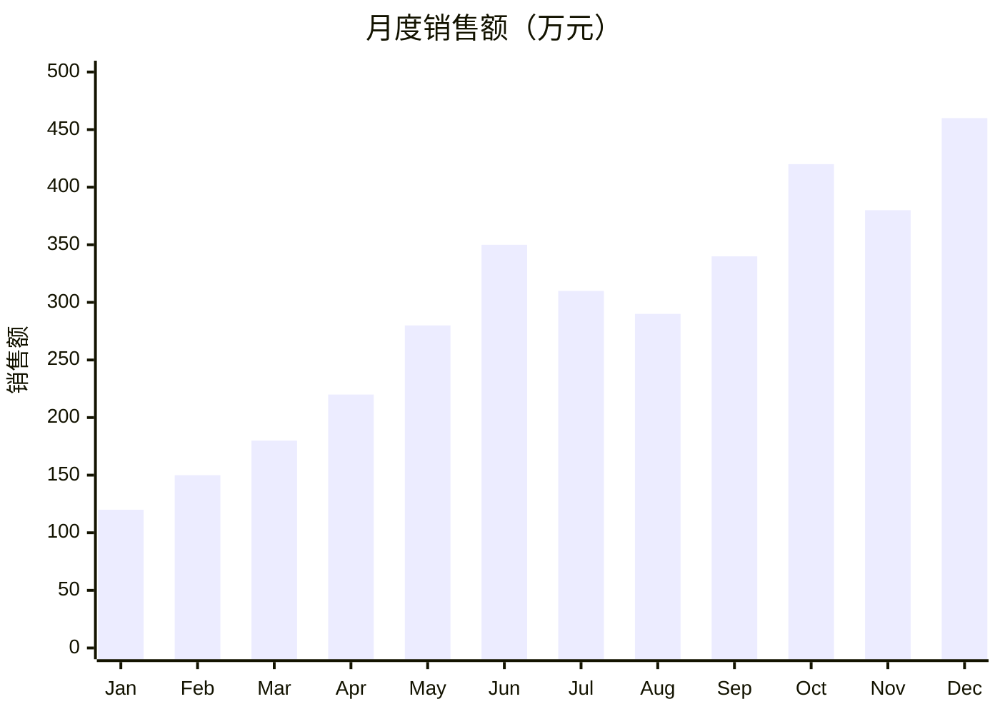
```mermaid
xychart-beta
    title "月度销售额（万元）"
    x-axis [Jan, Feb, Mar, Apr, May, Jun, Jul, Aug, Sep, Oct, Nov, Dec]
    y-axis "销售额" 0 --> 500
    bar [120, 150, 180, 220, 280, 350, 310, 290, 340, 420, 380, 460]
```

### 19. XY Chart 折线图

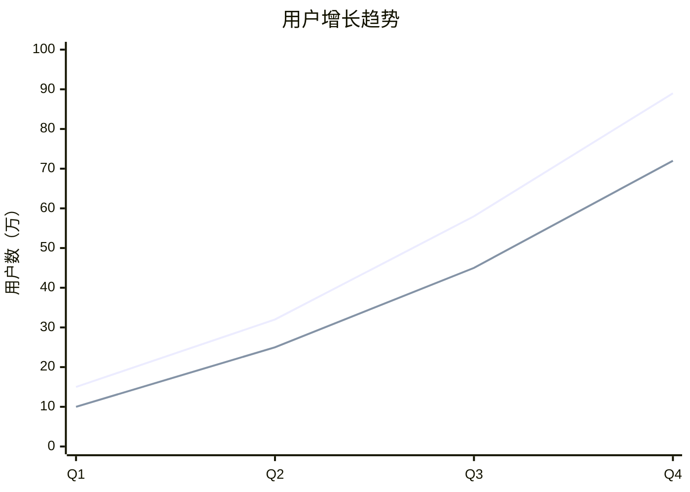
```mermaid
xychart-beta
    title "用户增长趋势"
    x-axis [Q1, Q2, Q3, Q4]
    y-axis "用户数（万）" 0 --> 100
    line [15, 32, 58, 89]
    line [10, 25, 45, 72]
```

### 20. XY Chart 柱状+折线混合

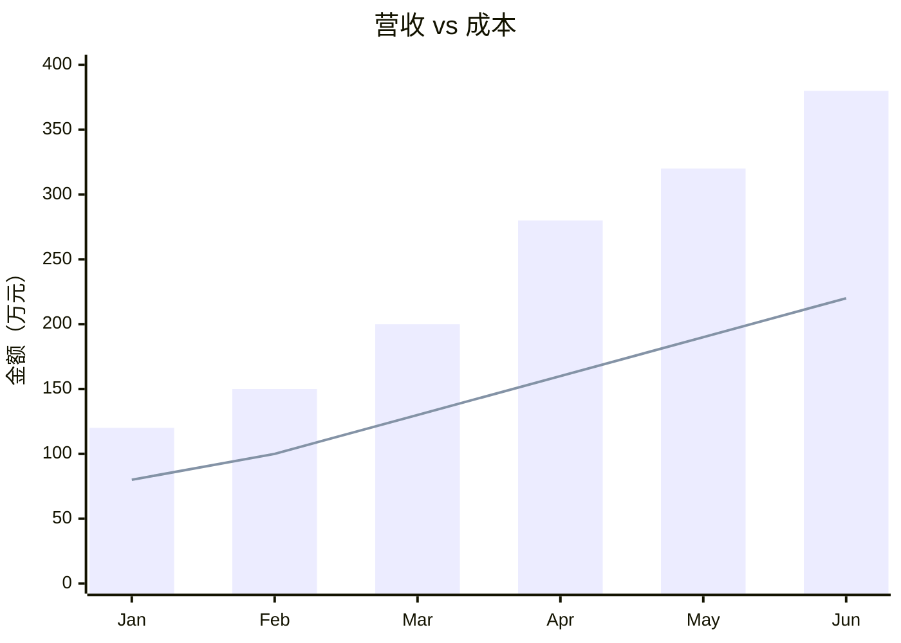
```mermaid
xychart-beta
    title "营收 vs 成本"
    x-axis [Jan, Feb, Mar, Apr, May, Jun]
    y-axis "金额（万元）" 0 --> 400
    bar [120, 150, 200, 280, 320, 380]
    line [80, 100, 130, 160, 190, 220]
```

### 21. Pie 饼图

```mermaid
pie title 技术栈分布
    "TypeScript" : 45
    "Python" : 25
    "Go" : 15
    "Rust" : 10
    "Other" : 5
```

### 22. Quadrant Chart 四象限图

```mermaid
quadrantChart
    title Tech Selection
    x-axis "Low Cost" --> "High Cost"
    y-axis "Low Perf" --> "High Perf"
    quadrant-1 "Worth it"
    quadrant-2 "Caution"
    quadrant-3 "Consider"
    quadrant-4 "Skip"
    React: [0.8, 0.7]
    Vue: [0.3, 0.6]
    Svelte: [0.4, 0.8]
    Angular: [0.9, 0.65]
    jQuery: [0.15, 0.2]
    Solid: [0.55, 0.85]
```

### 23. Git Graph 分支图

```mermaid
gitGraph
    commit id: "init"
    commit id: "feat: auth"
    branch develop
    checkout develop
    commit id: "feat: login"
    commit id: "feat: register"
    branch feature/oauth
    checkout feature/oauth
    commit id: "feat: oauth2"
    commit id: "fix: token"
    checkout develop
    merge feature/oauth id: "merge oauth"
    checkout main
    merge develop id: "release v1.0" tag: "v1.0"
    commit id: "hotfix: session"
```

### 24. Block Diagram 块图

```mermaid
block-beta
    columns 3
    
    Frontend["前端应用"]:3
    
    space:1 API["API 网关"] space:1
    
    UserSvc["用户服务"] OrderSvc["订单服务"] ProductSvc["商品服务"]
    
    DB[("数据库")]:2 Cache[("缓存")]
    
    Frontend --> API
    API --> UserSvc
    API --> OrderSvc
    API --> ProductSvc
    UserSvc --> DB
    OrderSvc --> DB
    ProductSvc --> Cache
```

---

## 四、验证清单

| # | 图表类型 | 语法 | 验证点 |
|---|---------|------|--------|
| 1 | flowchart | Mermaid | 节点+箭头+判断分支 |
| 2 | sequence | Mermaid | 参与者+消息+alt块 |
| 3 | class | Mermaid | 类+属性+继承关系 |
| 4 | state | Mermaid | 状态+转换+起止符 |
| 5 | er | Mermaid | 实体+字段+关系线 |
| 6 | gantt | Mermaid | 时间轴+任务条+里程碑 |
| 7 | mindmap | Mermaid | 树形展开+多级 |
| 8 | timeline | Mermaid | 时间点+事件 |
| 9 | c4 | Mermaid | 系统边界+关系 |
| 10 | sankey | Mermaid | 流带+标签 |
| 11 | journey | Mermaid | 阶段+评分+参与者 |
| 12 | architecture | Mermaid subgraph | 分层+分组+连线 |
| 13 | swimlane | Mermaid subgraph | 泳道分区+流程 |
| 14 | network | Mermaid subgraph | 拓扑分层+连线 |
| 15 | decision-tree | Mermaid flowchart | 判断节点+分支 |
| 16 | dataflow | Mermaid subgraph | 数据流向+分组 |
| 17 | orgchart | Mermaid flowchart | 树形层级+连线 |
| 18 | bar chart | xychart-beta | 柱状图+轴标签 |
| 19 | line chart | xychart-beta | 折线+多系列 |
| 20 | bar+line | xychart-beta | 混合图表 |
| 21 | pie | Mermaid | 扇区+标签+颜色 |
| 22 | quadrant | Mermaid | 四象限+散点定位 |
| 23 | gitGraph | Mermaid | 分支+合并+标签 |
| 24 | block | block-beta | 块+列布局+连线 |
**Mermaid 无法覆盖（继续走 diagram skill PNG）**：SWOT 图、鱼骨图、文氏图、雷达图（radar-beta 尚不稳定）、热力图、散点图、漏斗图、瀑布图
