# DSL 渲染测试 — Mermaid + Graphviz

> 覆盖全部 12 种结构图的 DSL 渲染，验证 preview-md 的 mermaid.js 和 viz.js 集成。

---

## 一、Mermaid 图表（11 种）

### 1. Flowchart 流程图

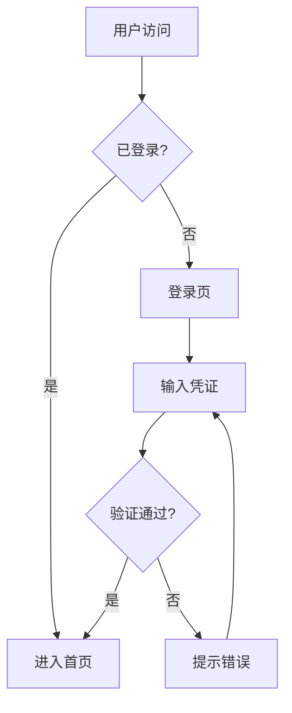

### 2. Sequence 时序图

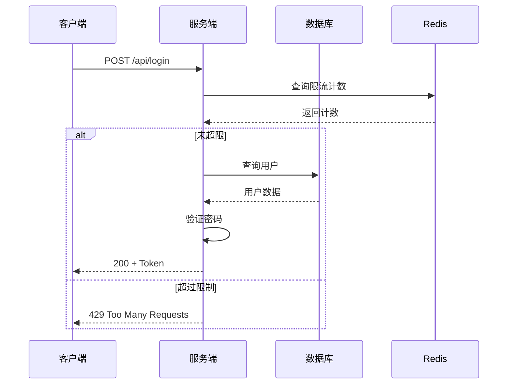

### 3. Class 类图

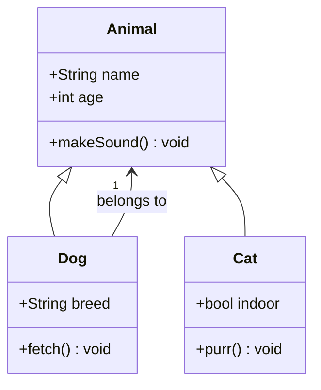

### 4. State 状态图

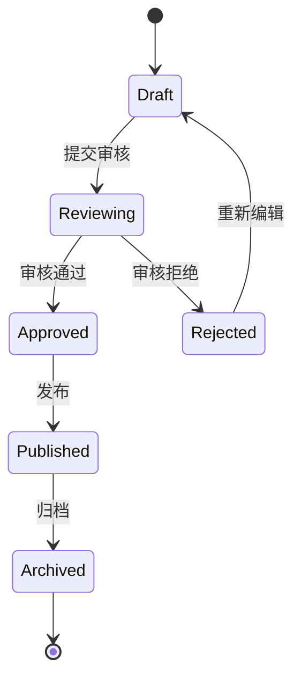

### 5. ER 图

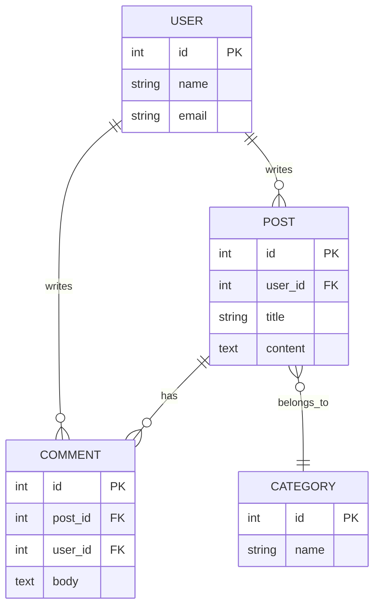

### 6. Gantt 甘特图

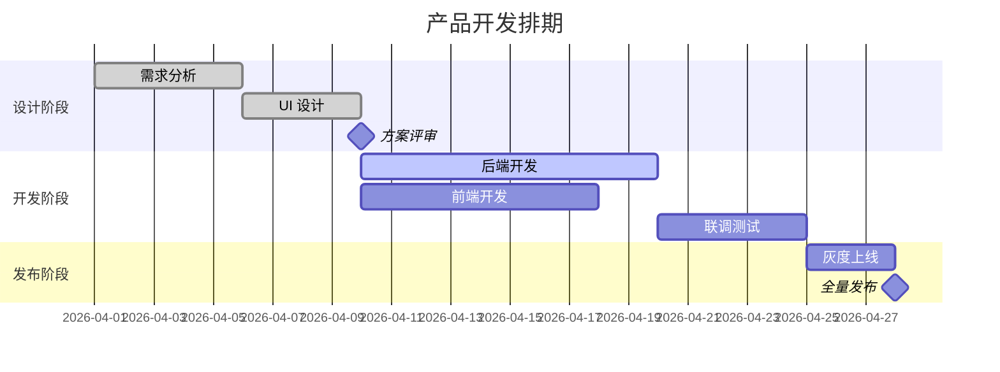

### 7. Mindmap 思维导图

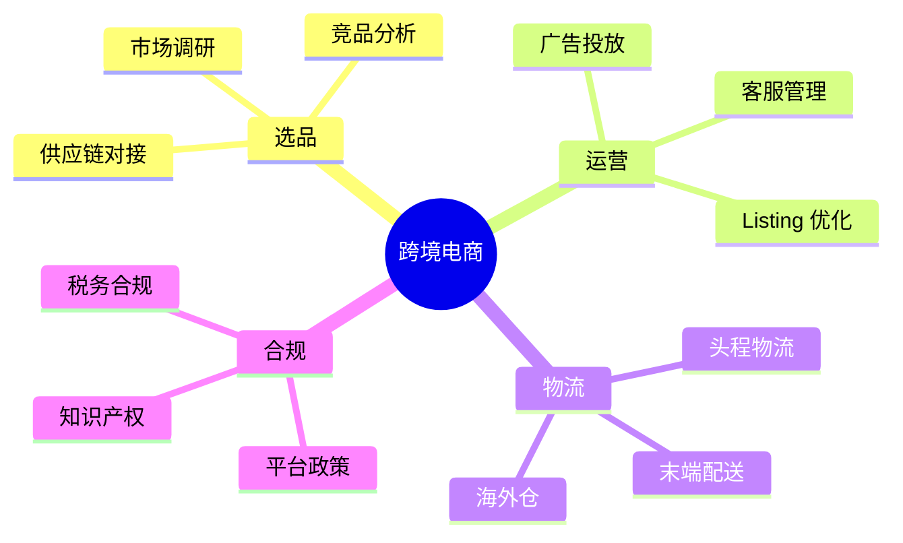

### 8. Timeline 时间线

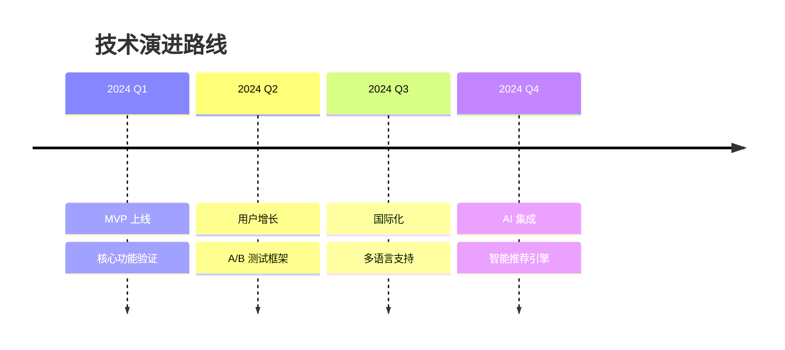

### 9. C4 架构图

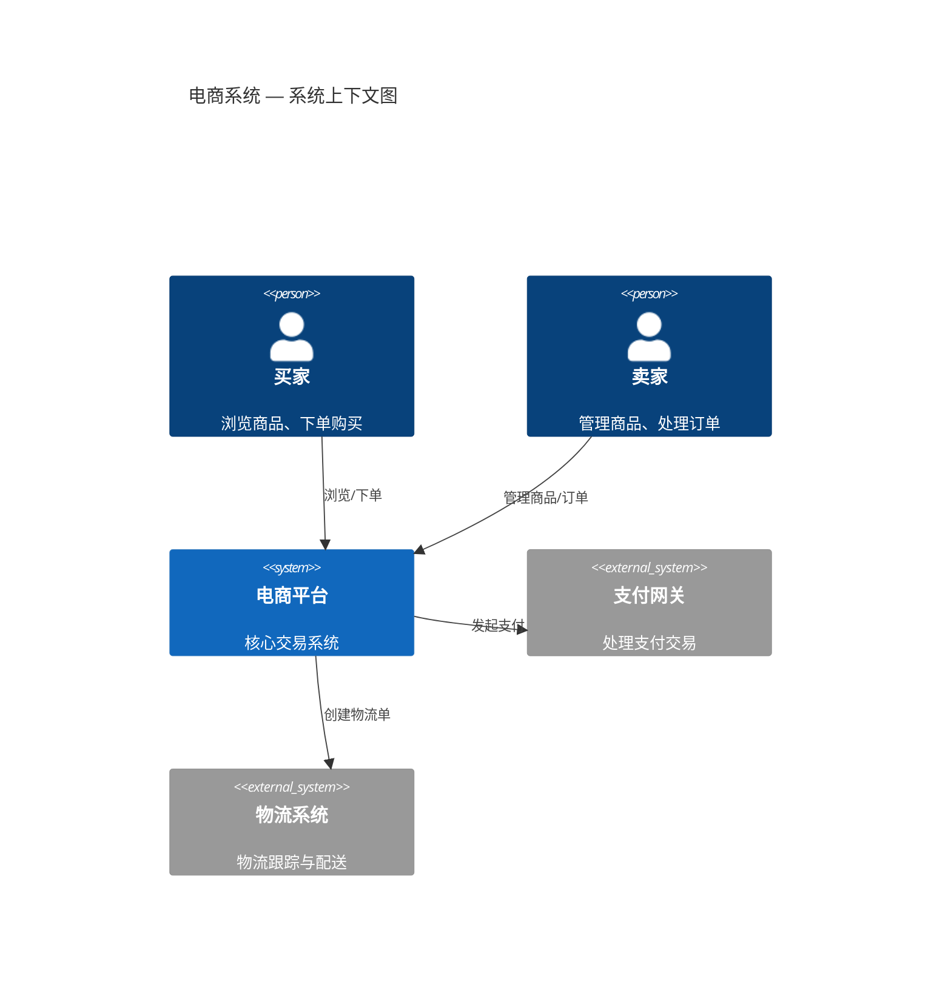

### 10. Sankey 桑基图

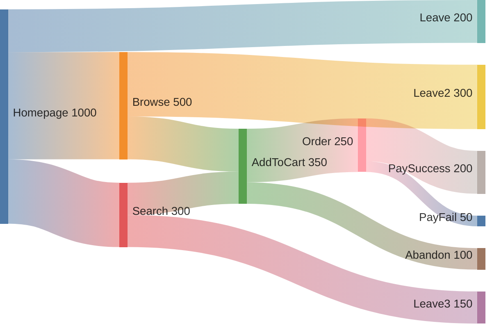

### 11. Journey 旅程图

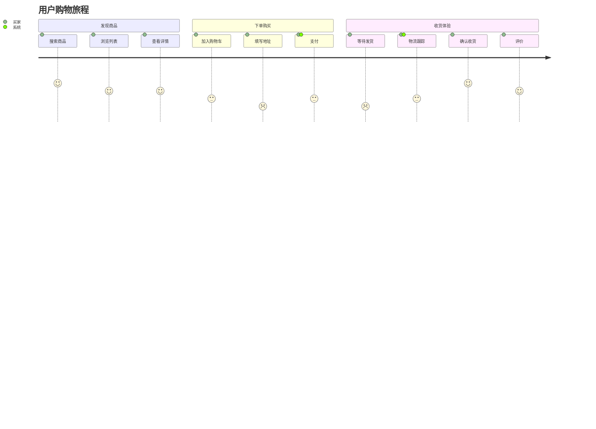

---

## 二、Graphviz 图表（6 种）

### 11. Architecture 架构图

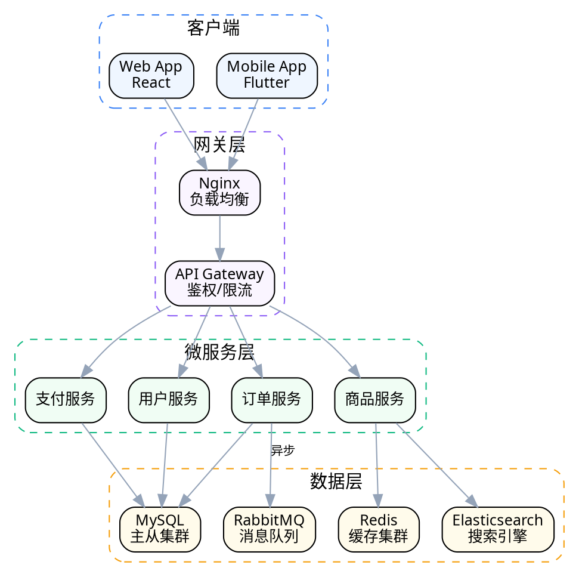

### 12. Swimlane 泳道图（用 subgraph 模拟）

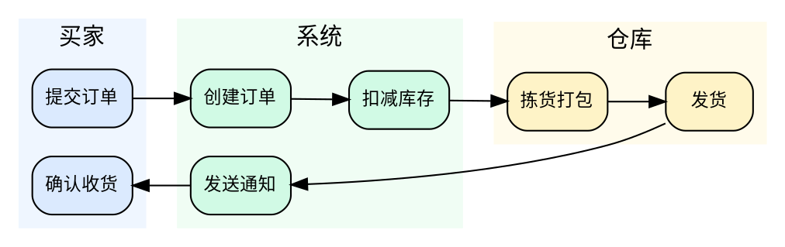

### 14. Network 网络图

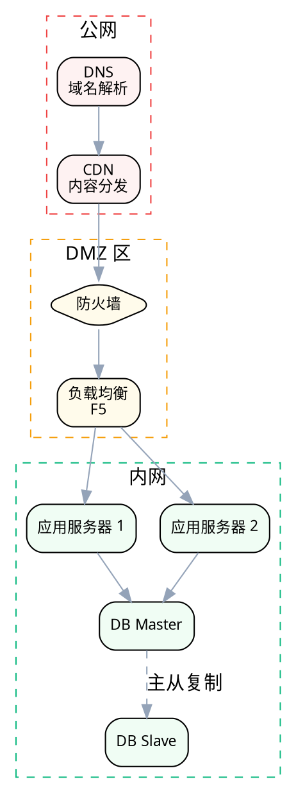

### 15. Decision Tree 决策树

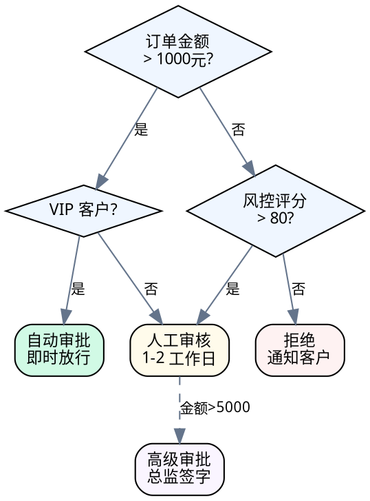

### 16. Dataflow 数据流图

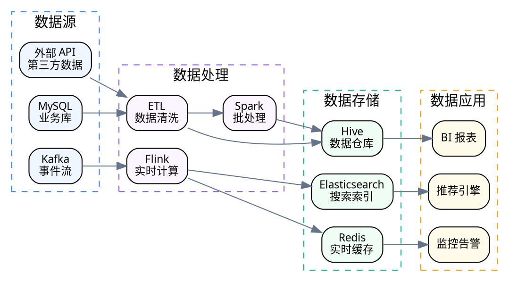

### 17. Orgchart 组织结构图

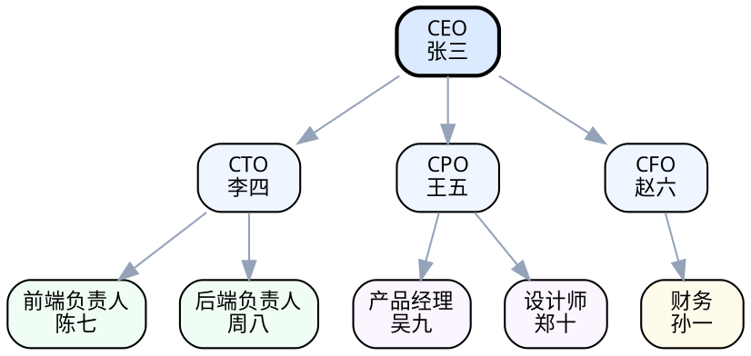

---

## 三、验证清单

| # | 图表类型 | DSL | 预期 |
|---|---------|-----|------|
| 1 | flowchart | Mermaid | 节点+箭头+判断分支正常 |
| 2 | sequence | Mermaid | 参与者+消息+alt块正常 |
| 3 | class | Mermaid | 类+属性+继承关系正常 |
| 4 | state | Mermaid | 状态+转换+起止符正常 |
| 5 | er | Mermaid | 实体+字段+关系线正常 |
| 6 | gantt | Mermaid | 时间轴+任务条+里程碑正常 |
| 7 | mindmap | Mermaid | 树形展开正常 |
| 8 | timeline | Mermaid | 时间点+事件正常 |
| 9 | c4 | Mermaid | 系统边界+关系正常 |
| 10 | sankey | Mermaid | 流带+标签正常 |
| 11 | journey | Mermaid | 阶段+评分+参与者正常 |
| 12 | architecture | Graphviz | 分层+分组+连线正常 |
| 13 | swimlane | Graphviz | 泳道分区+流程正常 |
| 14 | network | Graphviz | 拓扑分层+连线正常 |
| 15 | decision-tree | Graphviz | 判断节点+分支正常 |
| 16 | dataflow | Graphviz | 数据流向+分组正常 |
| 17 | orgchart | Graphviz | 树形层级+连线正常 |

**不支持 DSL 的图表**（继续走 PNG）：SWOT 图、鱼骨图、文氏图
